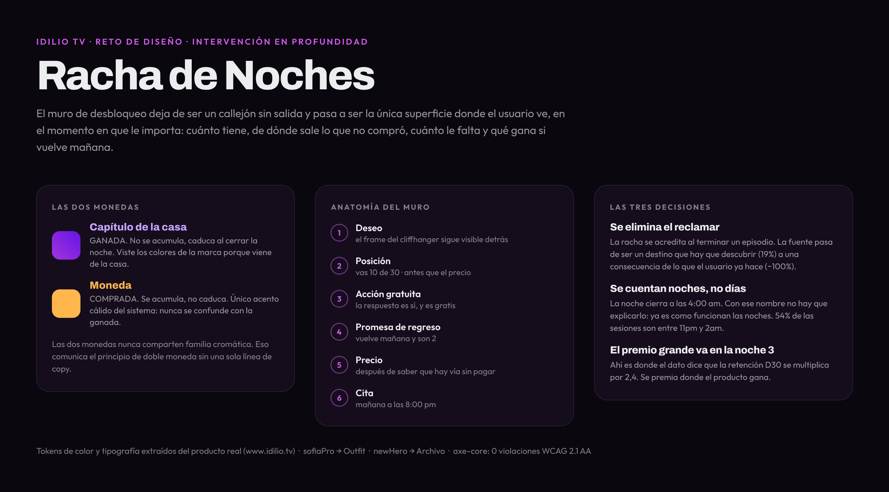
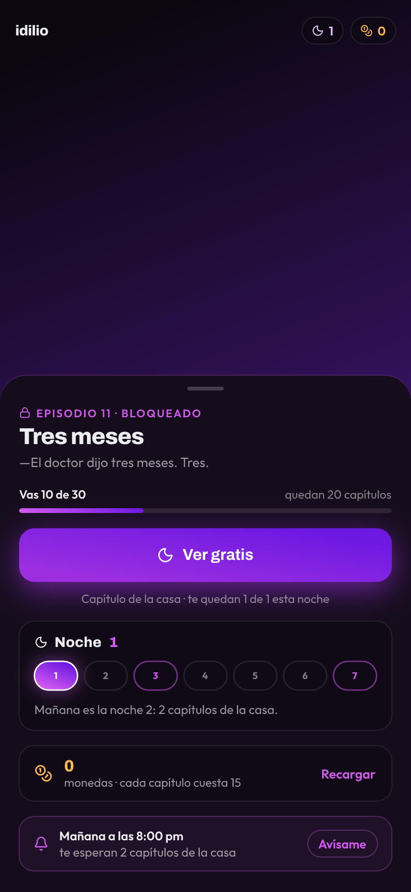
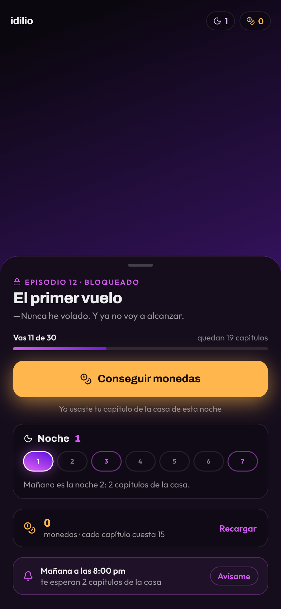
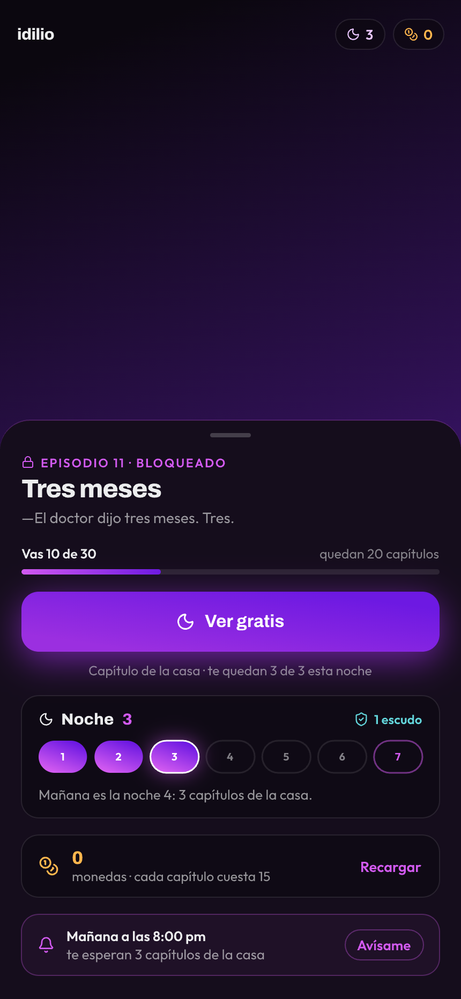
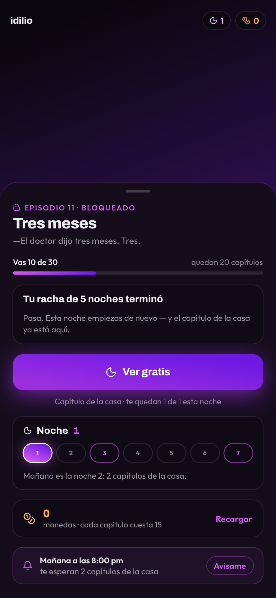
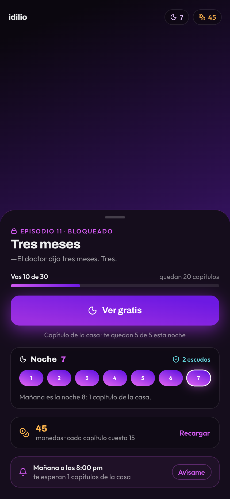
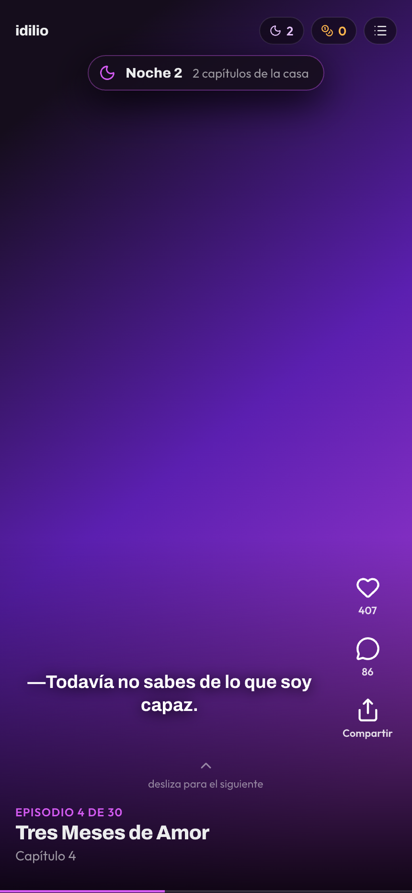
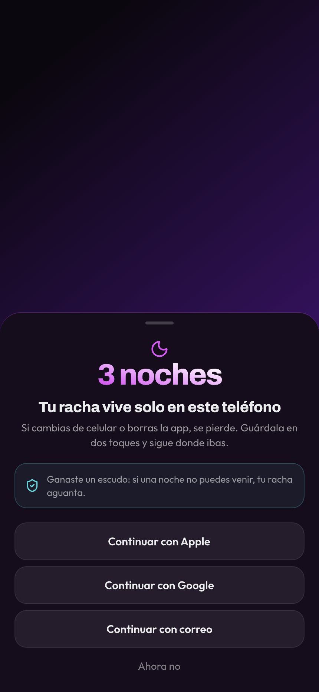

# Diseño

Construido en **Pencil** (`.pen`), con los tokens de color y tipografía extraídos del
producto real en producción. Exportado a PNG @2x en [`pencil/`](pencil).

| | Pantalla |
|---|---|
|  | **Portada y sistema** — las dos monedas, la anatomía del muro y las tres decisiones |
|  | **Muro · A** — noche 1, invitado, sin monedas |
|  | **Muro · B** — pase gastado, sin monedas *(el estado que monetiza)* |
|  | **Muro · E** — noche 3, hito con escudo |
|  | **Muro · F** — racha rota |
|  | **Muro · H** — noche 7, ciclo completo |
|  | **Reproductor** — confirmación de racha *(toast, no modal)* |
|  | **Cuenta** — "tu racha vive solo en este teléfono" |

## Tokens

Extraídos con `getComputedStyle` sobre `www.idilio.tv`, no inventados
(ver [`.context/research/01-design-tokens-idilio.md`](../.context/research/01-design-tokens-idilio.md)).

```
--home-black     #000000      --home-magenta   #d25af0
--home-surface-1 #0b070f      --home-violet    #6d19e2
--home-surface-2 #150d1c      --home-cyan      #63d6dc
--home-surface-3 #1e1426      --home-amber     #ffb64d
texto base       #ecedee
```

**Tipografía.** El producto usa `sofiaPro` (UI) y `newHero` (display), ambas de licencia
comercial. El diseño y el POC sustituyen por **Outfit** y **Archivo**, los equivalentes
libres más cercanos. La sustitución se declara; no se disimula.

**Regla semántica.** La moneda **ganada** y la racha visten violeta→magenta (los colores de
la marca: el capítulo es *de la casa*); la moneda **comprada** viste ámbar. Las dos monedas
nunca comparten familia cromática — así el principio de doble moneda se comunica sin copy.
