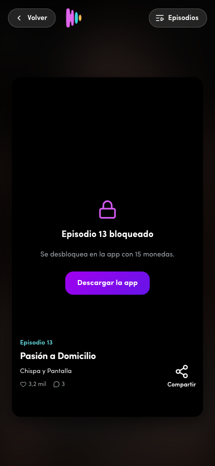
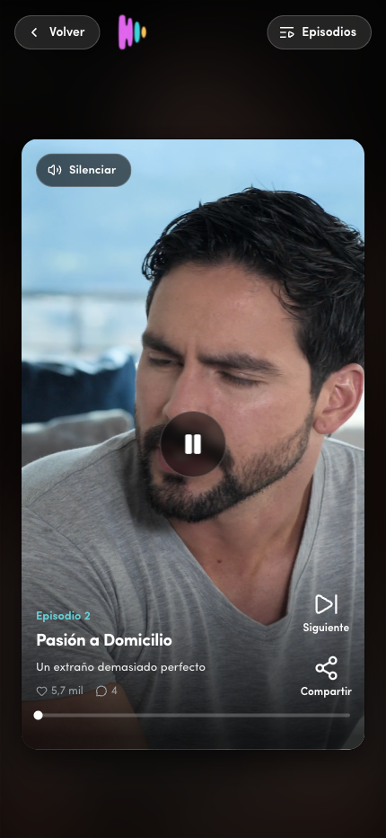
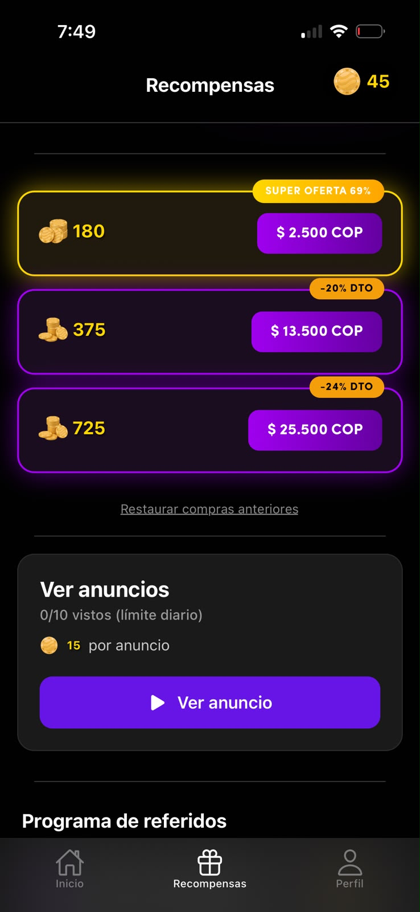
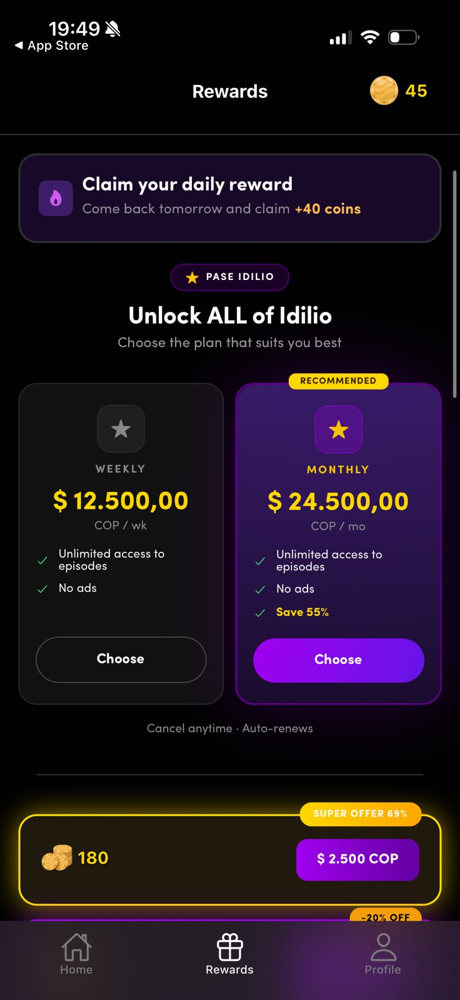
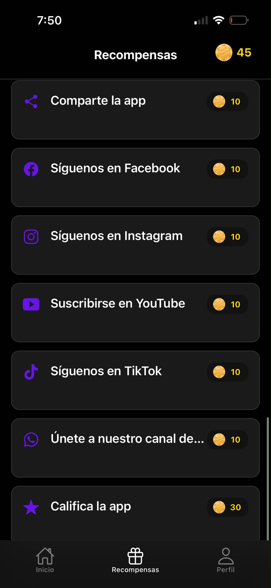
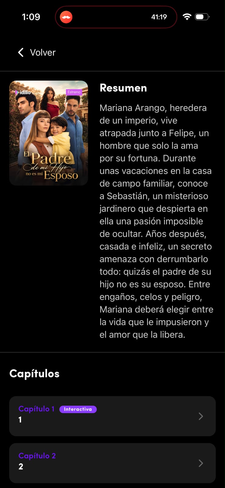
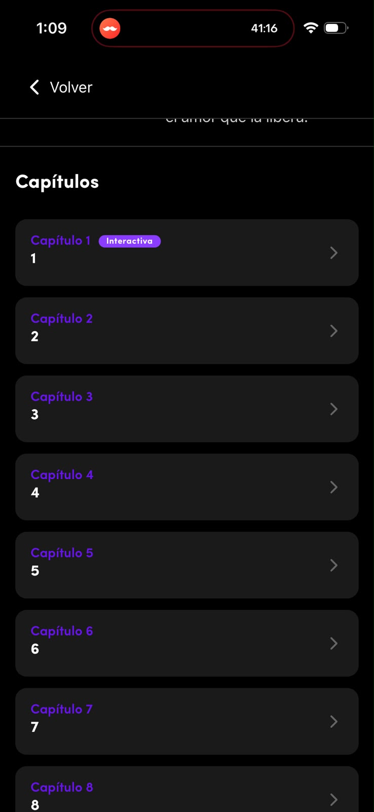
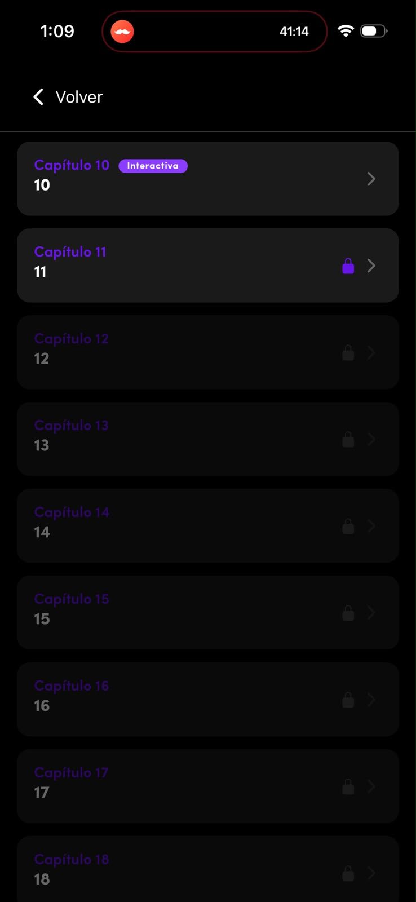

# Registro de dogfooding — Idilio TV
Dogfooding —usar el propio producto como un usuario más— manual: 2026-08-25 · Censo del catálogo, rehecho y corregido: 2026-08-26 · Superficies usadas: web player (el reproductor en el navegador, idilio.tv) + App Store MX (build 1.20.0, 2026-08-21)

## Qué se pudo usar y qué no
- **idilio.tv es un reproductor web funcional**, no solo un landing. Reproduce episodios, tiene lista de episodios, autoplay al siguiente y muro de bloqueo. No tiene economía (ni saldo, ni recompensas, ni perfil).
- La economía completa vive solo en la app nativa. Evidencia de la app: capturas oficiales de App Store del build vigente (1.20.0) + release notes.

## Hechos verificados (no hipótesis)

### Catálogo y estructura de serie
| Dato | Valor | Fuente |
|---|---|---|
| Serie muestreada | "Pasión a Domicilio" | web player |
| Episodios de la serie | 56 (Temporada 1) | panel "Episodios" |
| Episodios gratis | 1–12 | panel: ep. 13 en adelante marcado "bloqueado" |
| Episodios bloqueados | 44 | 56 − 12 |

### Precio del sumidero
| Dato | Valor | Fuente |
|---|---|---|
| Costo de desbloqueo | **15 monedas / episodio** | muro web ("Se desbloquea en la app con 15 monedas") + paywall nativo, el muro de pago de la app ("Costo del episodio: 15") |
| Costo de completar la serie | **660 monedas** | 44 × 15 |

### Paquetes de monedas (paywall nativo, captura oficial)

<!-- cifras-citadas -->
<!-- Los precios tachados de acá abajo son los del producto REAL, no los de la
     propuesta. El guardián de cifras persigue "$2.49" porque la escalera que
     proponemos no lleva ancla tachada; acá es evidencia, no una recaída. -->
| Monedas | Precio | Badge | Episodios | **Precio por episodio** |
|---|---|---|---|---|
| 180 | **$ 2.500 COP** | SUPER OFERTA 69% | 12 | **$ 208** |
| 375 | **$ 13.500 COP** | −20% DTO | 25 | **$ 540** |
| 725 | **$ 25.500 COP** | −24% DTO | 48 | **$ 531** |

<!-- /cifras-citadas -->

**En qué moneda cobra la tienda.** En pesos. Las capturas de la ficha del build 1.20.0 traen los precios en dólares —`$0.99 USD`, `$1.99 USD`, `$3.99 USD`— pero ese material es de la **ficha de tienda**, la misma imagen para todos los países. La tabla de arriba está medida dentro de la app con storefront de Colombia, y coincide con lo que declara Google Play: *«Compras en la app: $ 1.900-$ 59.900 por elemento»*.

**La escalera de precios, medida.** El primer paquete cuesta **$ 208 por episodio** y los otros dos, **$ 540 y $ 531**. Los dos escalones grandes se diferencian en un 1,7%: subir de 375 a 725 monedas —casi el doble de dinero— mejora el precio por episodio en nueve pesos. Y los tres llevan badge de descuento a la vez.

### El Pase Idilio (suscripción)

| Plan | Precio | Lo que ofrece |
|---|---|---|
| **Semanal** | **$ 12.500 COP / semana** | Acceso ilimitado a episodios · sin anuncios |
| **Mensual** | **$ 24.500 COP / mes** | Lo mismo, con badge *RECOMMENDED* y *«Save 55%»* |

Vive en la pestaña **Recompensas**, encabezando la sección, con las dos opciones comparadas. El muro no lo ofrece.

**El número que hay que mirar:** terminar la serie mediana comprando monedas —40 episodios bloqueados × 15 = 600 monedas— sale unos **$ 21.000** al precio de los escalones grandes. El mensual, que abre **el catálogo entero**, cuesta **$ 24.500**. Una sola serie cuesta casi lo mismo que un mes de todo.

### Las cuatro fuentes gratuitas de monedas

Medidas en la pestaña Recompensas de la app, con storefront de Colombia. Están las cuatro en un solo lugar, y **ninguna aparece en el muro**.

| Fuente | Cuánto da | Cadencia | En episodios |
|---|---|---|---|
| **Ver anuncios** | 15 monedas por anuncio · **tope 10 diarios** | recurrente, diaria | **hasta 10 episodios por día** |
| **Recompensa diaria** | 40 monedas | recurrente, diaria | 2 episodios por día |
| Tareas sociales | 10 monedas cada una · 30 por calificar la app | **una sola vez** | 6 episodios en total |
| Programa de referidos | sin cifra capturada | por referido | — |

**El anuncio recompensado es, con diferencia, la fuente más grande del sistema, y este entregable no la tenía.** Diez anuncios diarios a 15 monedas son 150 monedas al día: **70 episodios gratis por semana**. La sesión promedio consume 14 episodios y el usuario entra 2.3 veces por semana, o sea unos 32 episodios semanales. **La fuente gratuita recurrente duplica con creces el consumo.** Un usuario que sepa que el botón existe no choca nunca con un muro.

Hay una tensión de diseño encima: el Pase Idilio se vende con *«sin anuncios»* como una de sus dos ventajas. O sea que la suscripción cobra por quitar la fuente gratuita más generosa del producto.

### La app nativa, tal como es hoy
- Barra superior: logo + **chip de saldo** (la pastilla que muestra las monedas, ej. 2543) + búsqueda.
- Rieles home (las filas horizontales de pósters que se arrastran con el dedo): círculos "Volver por tu próxima novela" → Estrenos → Seguir viendo → Lo más visto → Última Hora → Nuestra selección para ti.
- Tab bar (la barra de pestañas de abajo) de 3: **Inicio · Recompensas · Perfil** (Perfil con punto rojo de notificación).
- Player: overlay (la capa de botones encima del video) tipo TikTok (corazón, comentario, compartir), chip de saldo abajo-izquierda, "ver más" para sinopsis.
- **Ficha de serie:** barra «Volver» y nada más arriba —el título no se repite, va quemado en el arte del póster—, bloque **«Resumen»** con la miniatura a la izquierda y la sinopsis del catálogo al lado, y después **«Capítulos»**: una lista de tarjetas, no una grilla. Cada tarjeta lleva `Capítulo N` en violeta, el número del episodio como título, un galón a la derecha y —en algunos— la píldora **«Interactiva»**. Los bloqueados llevan candado: el primero en violeta encendido, los siguientes atenuados. **En ninguna tarjeta aparece el precio.**
- **La recompensa diaria se ofrece al abrir la app**, en un diálogo que aparece la primera vez que se entra cada día y que exige tocar **Reclamar**. No es solo un contenido de la pestaña Recompensas —donde también vive—: es un interstitial ineludible entre el usuario y la app. *Dato aportado por el equipo de Idilio, no observado en el dogfooting: el build al que tuve acceso no lo mostró. Es el hecho que sostiene [F1](../01-diagnostico/#f1--la-fuente-llega-cuando-no-hace-falta-y-falta-cuando-hace-falta), así que conviene que su procedencia esté declarada.*
- **La pestaña Recompensas no es solo la recompensa diaria.** Lleva además una lista de tareas de una sola vez: **compartir la app** y seguir las cuentas de **Facebook, Instagram, YouTube, TikTok y WhatsApp** a **10 monedas** cada una, y **calificar la app** a **30**. Son 90 monedas —seis episodios exactos— y se agotan: a nadie se le paga dos veces por seguir la misma cuenta. La captura está abajo.
- Release notes 1.20.0 (2026-08-21): *"Downloads for suscriptions / New daily streak UI"* —«nueva interfaz de la racha diaria»— → la racha se está iterando ahora mismo.

## Fricciones observadas de primera mano (web)
1. El reproductor web **no muestra saldo ni economía**: quien llega por un link compartido no ve el sistema, solo un muro.
2. El muro web es un callejón: única salida "Descargar la app". El contexto (serie, episodio, progreso) **no se transfiere** al deep link (el enlace que debería abrir la app justo en esa pantalla).
3. La lista de episodios muestra 44 números grises sin precio, sin total, sin "cuánto me falta". La progresión no es legible. **En la app nativa la lista es otra —tarjetas de «Capítulo N», no una grilla— y el resultado es el mismo:** dice cuáles están bloqueados y no dice cuántos faltan, cuánto lleva visto el usuario ni cuánto cuesta abrir el siguiente.
4. El autoplay al siguiente episodio funciona muy bien hasta el ep. 12; en el 13 el loop se corta en seco sin transición.
5. Imágenes de póster bloqueadas por CSP en el web player (error de consola) → el catálogo carga con huecos.

---

## Capturas de la evidencia

| | |
|---|---|
|  |  |
| **Paywall nativo, build 1.20.0.** `Costo del episodio: 15` · `Tu balance: 0` · solo opciones de compra. Dos paquetes distintos entregan las mismas 180 monedas. | **Home nativo.** Chip de saldo arriba a la derecha, tab bar de 3 con *Recompensas* y *Perfil*. La fuente gratuita vive aquí; el sumidero vive en el player. |
|  |  |
| **Muro del reproductor web.** *"Se desbloquea en la app con 15 monedas"* y una sola salida: descargar la app. El contexto de serie y episodio se pierde en el salto. | **Reproductor web.** Funciona bien, autoplay al siguiente episodio incluido — pero sin saldo, sin recompensas y sin ninguna huella de la economía. |

**La pestaña Recompensas.** Ahí vive toda la economía menos el gasto: las cuatro fuentes gratuitas, los tres paquetes y la suscripción. Todo a un toque del usuario **si se le ocurre ir a buscarlo** — y nada de eso aparece en el muro, que es donde el usuario está cuando necesita monedas.

| | |
|---|---|
|  |  |
| **Los paquetes y los anuncios.** 180 a $ 2.500, 375 a $ 13.500 y 725 a $ 25.500, los tres con badge de descuento. Debajo, *«Ver anuncios · 0/10 vistos (límite diario) · 15 por anuncio»* — la fuente más grande del sistema. Y más abajo, el programa de referidos. | **El Pase Idilio y la recompensa diaria.** *«Claim your daily reward — Come back tomorrow and claim +40 coins»*, y debajo los dos planes: semanal $ 12.500 COP y mensual $ 24.500 COP con *«Save 55%»*. Las dos ventajas que vende son acceso ilimitado y **sin anuncios**. |

| | |
|---|---|
|  | **Recompensas, app nativa.** Compartir la app, seguir Facebook, Instagram, YouTube, TikTok y el canal de WhatsApp: **10 monedas** cada una. Calificar la app: **30**. Noventa monedas en total, que son **seis episodios** — y después de eso, la única fuente que queda es la diaria. El saldo de la captura, `45`, son tres episodios: menos de lo que dura media sesión. |

**La ficha de serie en la app nativa.** Es la pantalla que el prototipo reproduce, y estas tres capturas son la fuente: de acá salen la estructura, los colores y hasta la píldora «Interactiva».

| | | |
|---|---|---|
|  |  |  |
| **Arriba: «Volver» y «Resumen».** Sin título, sin contador de episodios, sin barra de avance. El póster a la izquierda y la sinopsis del catálogo al lado. | **«Capítulos».** Tarjetas de `Capítulo N` con el número como título y el galón a la derecha. La píldora «Interactiva» marca los episodios con decisión. | **El muro, dicho con un candado.** El capítulo 11 lleva candado violeta encendido; del 12 en adelante la tarjeta entera se apaga. **El precio no aparece en ningún lado.** |

---

## Censo del catálogo completo

El reproductor web renderiza en servidor la lista de episodios con sus bloqueos, así que medir el catálogo entero es cuestión de recorrerlo. El script está en [`scrape-catalogo.mjs`](scrape-catalogo.mjs) y los datos crudos en [`catalogo.json`](catalogo.json).

Cómo está construido, y por qué de esa forma — las cuatro reglas son las cuatro maneras en que un censo así miente sin dar error:

- **Los ids salen del `sitemap.xml`, no del home.** Los enlaces del home son rieles curados: una selección editorial, no el inventario. El catálogo que el propio sitio declara tiene **50 series**; raspar los rieles deja siete afuera.
- **El total sale del contador que publica la ficha** (*"N episodios"*), no de `max(número de episodio)`, que falla en las series con huecos de numeración.
- **Cada ficha se reintenta tres veces** antes de darla por perdida.
- **Si una sola ficha no se puede leer, el script termina con error y no emite censo.** Es la regla que más importa: una ficha que devuelve 200 y no se deja parsear se emite como `total: 0` y ese cero se suma a los agregados como si fuera una serie vacía, sin que nada falle. Un censo que se cae es recuperable; uno que miente por omisión, no.

Tres series del catálogo son exactamente ese caso —*La Venganza de una Esposa Después de la Muerte* (65 episodios, 10 gratis), *Las Flores del Amor* (52 episodios, 12 gratis) y *Lágrimas en el Altar* (10 episodios, gratis entera)— y una de ellas, *Las Flores del Amor*, es una de las cuatro excepciones a los 10 gratis.

Y el verificador de cifras se apoya en el censo, así que no puede filtrar las entradas con `total > 0`: descartaría justo las rotas y compararía el censo consigo mismo.

Las excepciones a los 10 gratis son **cuatro**: *La Herencia del Patriarca Enamorado* (7), *La Mágica Navidad del Amargado Millonario* (11), *Pasión a Domicilio* (12) — la serie que me tocó — y *Las Flores del Amor* (12).

### Lo que confirma

| | |
|---|---|
| Costo de desbloqueo | **15 monedas, sin una sola excepción** en las 41 series con muro |
| Estructura | Bloque gratis al inicio, todo lo demás bloqueado. Ninguna serie mezcla |

### El agregado

| | |
|---|---|
| Series | **50** (41 con muro · 9 enteramente gratis, todas de ≤10 episodios) |
| Episodios totales | **2.230** |
| Episodios gratis | **500** — el 22% del catálogo |
| Episodios bloqueados | **1.728** — el 78% |
| Costo de la serie mediana | 600 monedas ≈ **$6,63** |
| Costo del catálogo completo | 25.920 monedas ≈ **$286** |

*(Dólares calculados al precio de escalera vigente: $1.99 → 180 monedas = 90.5 monedas por dólar.)*

500 + 1.728 son 2.228, dos menos que 2.230. No es un error de suma: dos series tienen un hueco en la numeración de episodios — *Apasionada por el Padre de mi Hijo que no es mi Esposo* y *Pasión Frente a los Colmillos del Conde*, uno cada una — así que el contador que publica la ficha declara un episodio más de los que la lista efectivamente enumera. El JSON lo registra en el campo `huecoDeNumeracion`. En el censo anterior la misma diferencia de dos existía y no estaba explicada en ninguna parte.

### El catálogo, serie por serie

| Serie | Episodios | Gratis | Bloqueados | Costo/ep | Costo total |
|---|---|---|---|---|---|
| El Hermanastro Enamorado | 74 | 10 | 64 | 15 | 960 |
| Mi Esposo es la Muerte | 72 | 10 | 62 | 15 | 930 |
| Enamoradas del Motociclista Mafioso | 70 | 10 | 60 | 15 | 900 |
| Esposa del Playboy Billonario | 70 | 10 | 60 | 15 | 900 |
| Había una Vez un Divorcio: La Doble Vida de Lady Diana | 70 | 10 | 60 | 15 | 900 |
| Rico Padre Pobre Madre | 69 | 10 | 59 | 15 | 885 |
| Esposo Fugitivo Ámame Otra vez | 68 | 10 | 58 | 15 | 870 |
| La Herencia del Patriarca Enamorado | 66 | 7 | 59 | 15 | 885 |
| La Enfermera Infiltrada | 65 | 10 | 55 | 15 | 825 |
| La Venganza de una Esposa Después de la Muerte | 65 | 10 | 55 | 15 | 825 |
| Enamorándome de mi Guardián Prohibido | 64 | 10 | 54 | 15 | 810 |
| Abrázame Fuerte Señor Bombero | 62 | 10 | 52 | 15 | 780 |
| Mi Amante Secreto | 62 | 10 | 52 | 15 | 780 |
| La Venganza de la Abogada | 61 | 10 | 51 | 15 | 765 |
| Creo que mi esposa quiere matarme | 60 | 10 | 50 | 15 | 750 |
| Enamorada de la Voz del Lobo | 60 | 10 | 50 | 15 | 750 |
| La Mesera Millonaria | 60 | 10 | 50 | 15 | 750 |
| La Venganza de la Hija del Esmeraldero | 60 | 10 | 50 | 15 | 750 |
| Quiero a mi Ex Fuera de mi Vida | 60 | 10 | 50 | 15 | 750 |
| Pasión a Domicilio | 56 | 12 | 44 | 15 | 660 |
| Las Flores del Amor | 52 | 12 | 40 | 15 | 600 |
| La Mágica Navidad del Amargado Millonario | 51 | 11 | 40 | 15 | 600 |
| Apasionada por el Padre de mi Hijo que no es mi Esposo | 50 | 10 | 39 | 15 | 585 |
| Aún Eres Tú | 50 | 10 | 40 | 15 | 600 |
| Aún Sigues Siendo Tú | 50 | 10 | 40 | 15 | 600 |
| El Juego de la Herencia | 50 | 10 | 40 | 15 | 600 |
| El Pecado de Nuestro Amor | 50 | 10 | 40 | 15 | 600 |
| Intenciones ocultas | 50 | 10 | 40 | 15 | 600 |
| La Niñera Poderosa | 50 | 10 | 40 | 15 | 600 |
| Mi Apuesto Guardaespaldas | 50 | 10 | 40 | 15 | 600 |
| La Más Hermosa y el Espejo | 49 | 10 | 39 | 15 | 585 |
| Buscando a mi Padre me Enamoré de mi Hermano | 40 | 10 | 30 | 15 | 450 |
| Milagro de Amor en Nochebuena | 31 | 10 | 21 | 15 | 315 |
| La Bandida que me Amó | 30 | 10 | 20 | 15 | 300 |
| Mi Final Feliz | 30 | 10 | 20 | 15 | 300 |
| Mi Mejor Pasajera | 30 | 10 | 20 | 15 | 300 |
| Sangre Enemiga | 30 | 10 | 20 | 15 | 300 |
| Simona la Libertadora Enamorada | 30 | 10 | 20 | 15 | 300 |
| Tres Meses de Amor | 30 | 10 | 20 | 15 | 300 |
| Somos Cuatro | 24 | 10 | 14 | 15 | 210 |
| Pasión Frente a los Colmillos del Conde | 21 | 10 | 10 | 15 | 150 |
| Chamado na Madrugada | 10 | 10 | 0 | — | — |
| Dulce Destino | 10 | 10 | 0 | — | — |
| La Mujer en el Bar | 10 | 10 | 0 | — | — |
| La Prometida del Enemigo | 10 | 10 | 0 | — | — |
| La Secretaria Heredera | 10 | 10 | 0 | — | — |
| Lágrimas en el Altar | 10 | 10 | 0 | — | — |
| Sesiones Prohibidas | 10 | 10 | 0 | — | — |
| Última Hora | 10 | 10 | 0 | — | — |
| Amor a Muerte | 8 | 8 | 0 | — | — |
