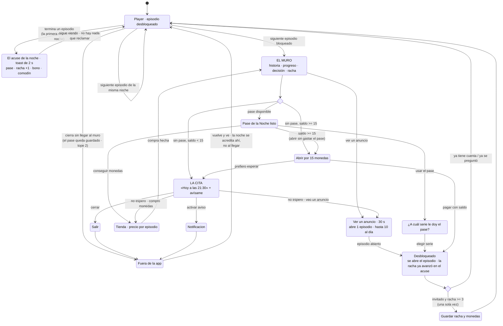

# 3. La intervención en profundidad

# «Continuará» — el Pase de la Noche

> **Una frase:** el muro de desbloqueo deja de ser el final de la sesión y pasa a ser una cita con hora, en la historia que el usuario ya está viendo.

**En este apartado:** la justificación de la elección · la mecánica · el diagrama de flujo · nueve decisiones de diseño · la revisión crítica del precedente · el modelo económico · los riesgos técnicos.
**Además:** [el archivo de diseño en Figma](https://www.figma.com/design/CCI8plwuWvfTV8VBpowN5X) — 10 pantallas, 4 componentes y las variables enlazadas, construido de forma nativa. La guía de lectura de esas pantallas y el sistema visual —42 tokens (los valores del sistema: colores, tipografías y espacios, con nombre propio) y 7 componentes— están en [Sistema y archivo de diseño](sistema.md). Los tokens, en [`tokens.json`](tokens.json).

---

## 3.1 Por qué esta intervención y no otra

De las ocho intervenciones de la estrategia, la elegida es esta, por cinco razones en orden de peso.

**1. Es la única que ataca el punto exacto donde la historia se corta.**
El corte no es un accidente: es la estructura del catálogo. La moda son 10 episodios gratis —37 de las 41 series con muro— y después 15 monedas por episodio, sin una sola excepción en el precio. El usuario no se detiene ahí porque se haya cansado de la historia: se detiene porque el episodio siguiente tiene precio.

Lo que sí conviene decir con precisión, porque el muro real lo cambia: **ese corte no es infranqueable.** Ahí mismo hay un anuncio de treinta segundos que abre el episodio gratis, hasta diez veces al día ([diagnóstico F1](../01-diagnostico/#f1--la-economía-está-a-la-vista-y-ordenada-al-revés)). Así que lo que corta la historia no es el precio: es que la salida gratuita está rotulada `0/10` en la tarjeta más apagada de la pantalla. Cualquier intervención que no toque ese segundo está optimizando alrededor del problema.

> **Dos precisiones.** Dónde cae el corte varía: *Pasión a Domicilio*, la serie del prototipo y de casi todos los ejemplos de este documento, regala 12 y no 10. Y que la sesión promedio de 14 episodios termine justo en el muro es la hipótesis del [diagnóstico §1.1](../01-diagnostico/#11-los-dos-hallazgos-que-ordenan-todo-lo-demás), no un hecho. Ninguna de las dos afecta el argumento: el corte por precio existe igual.

**2. Es la única que puede mover DAU/MAU por sí sola.**
Stickiness es una métrica de *regreso*. Para moverla hace falta una razón concreta para volver mañana. El muro es el único momento del producto donde el usuario quiere algo con urgencia — el único donde una promesa a futuro tiene valor real. No es que no pueda tenerlo: puede, viendo un anuncio. Es que ninguna de las salidas que tiene hoy le da una razón para volver **mañana**. Legibilidad de la moneda (I1) y progresión visible (I6) hacen mejor producto, pero no crean regreso.

**2bis. Y es la única que compite contra lo que el usuario realmente hace.**
Hoy el usuario tiene dos alternativas a pagar, y las dos son gratis: **ver un anuncio** —treinta segundos, ahí mismo, y sigue la misma historia— o **empezar otra de las 50 series** y comerse su bloque gratis. La segunda es la que gana, porque la primera está escondida en un `0/10`.

El Pase no compite con ninguna de las dos en lo que ofrecen. El anuncio también deja seguir donde estabas, y lo hace ya. **Lo que ninguna de las dos tiene es una hora.** El anuncio es transaccional: se agota en el momento en que se usa y no deja nada agendado. El Pase existe para lo que a las dos les falta — que mañana haya algo esperando en la historia que el usuario eligió. Empezar otra serie te devuelve al episodio 1 de una historia que todavía no te importa; el pase te devuelve al episodio 13 de *Pasión a Domicilio*, que es exactamente donde el muro te dejó.

Por eso la elección entre series (R2) no es solo pedagógica. Es el momento en que el usuario **declara cuál historia le importa** — que es exactamente el apego que hoy no existe y que la métrica de stickiness necesita.

**3. Resuelve el objetivo de experiencia como efecto secundario, no como pantalla aparte.**
El brief pide que el usuario entienda el valor de la moneda, sus fuentes, sus sumideros y su posición. La tentación es una pantalla que lo explique. Nadie lee esa pantalla. Aquí el usuario aprende el sistema porque tiene que **operarlo**: recibe un recurso escaso (un pase), decide dónde gastarlo (qué serie), ve el efecto (episodio abierto, racha +1) y ve lo que cuestan las alternativas — treinta segundos de anuncio, o $ 540 el episodio en la tienda. Es aprendizaje por uso.

**4. Funciona para el 88% que es invitado, desde el día uno.**
Sin cuenta, sin onboarding (la seguidilla de pantallas de bienvenida), sin perfil. El estado vive en el dispositivo y se ofrece migrar a cuenta solo cuando ya vale la pena.

**La alternativa más seria que quedó fuera:** el rediseño del diálogo de recompensa diaria como intervención independiente. Es más barato (2 semanas contra 5) y probablemente sube el reclamo del 19% a algo mucho mayor. Pero deja intacto el hecho de que la razón para volver sigue siendo una moneda abstracta y un calendario, no la historia. Sube una métrica intermedia sin cambiar el mecanismo. Terminó absorbido como I2 dentro de la Etapa 1 y como el reclamo inline del pase.

---

## 3.2 La mecánica en cinco reglas

**R1 · El pase se emite por reloj y se entrega al ver. No hay nada que reclamar.**
Son dos cosas distintas y conviene no mezclarlas:

- **Emisión.** El sistema genera **un pase por noche, por el reloj, hasta 7 por semana**. Ocurre esté el usuario o no: el derecho se genera aunque nadie abra la app.
- **Entrega.** El pase se acredita **cuando el usuario termina un episodio**. Ahí entra lo que tenga pendiente —uno si volvió anoche, dos si faltó—, avanza la racha y se paga el bono si toca. El usuario no toca nada: un toast de dos segundos se lo dice y sigue viendo. Nunca hay un botón, y nunca llega una notificación diciendo que algo *«se venció»*.

Es la corrección directa al **19% de reclamo** de la recompensa diaria, y la evidencia detrás es más fuerte de lo que parece. Hoy esa recompensa se ofrece en un diálogo al abrir la app: es ineludible, la ve todo el mundo, y aun así cuatro de cada cinco la cierran ([F1](../01-diagnostico/#f1--la-economía-está-a-la-vista-y-ordenada-al-revés)). O sea que la visibilidad ya está resuelta y el 19% no la explica. Lo que queda es el momento y el botón. Cambiando el momento —al muro, cuando el usuario quiere el episodio— y quitando el botón, la adopción de la fuente pasa a ~100% **por construcción**.

> La entrega al ver está tomada de la versión paralela de este mismo reto, donde estaba mejor resuelta. El razonamiento completo está en [`RECONCILIACION.md`](../RECONCILIACION.md).

**R1b · Lo pendiente se acumula hasta dos, y ahí se detiene.**
El techo de emisión es duro y por usuario, no por serie. El de acumulación es otro: **el saldo pendiente no pasa de 2**, y lo que se emite por encima de 2 mientras el usuario no aparece se pierde. Ese es el gradiente entero de la mecánica, y es fino a propósito: faltar una noche no cuesta nada —al volver hay dos esperando—, faltar dos seguidas ya deja un pase en el camino. Nadie recibe un castigo; el que vuelve seguido simplemente recoge todo lo que se emitió. El tope cubre además el caso de quien ve episodios gratis, recibe el pase y cierra la app sin llegar al muro. Se explica en §3.4bis.

**R2 · El usuario elige a qué serie se lo da.**
Con dos o más series empezadas, usar el pase abre una elección. Esta regla parece un detalle y es el centro pedagógico de todo: obliga a razonar sobre un recurso escaso — y el Pase es lo único escaso de esta economía, porque las monedas no lo son (diez episodios diarios en anuncios). Un recurso que se asigna se entiende; uno que se recibe, no.

**R3 · La unidad es la noche, y la noche corre de 5 a.m. a 5 a.m.**
54% de las sesiones pasan entre 11 p.m. y 2 a.m. Con corte a medianoche, ver el martes a las 23:40 y el miércoles a las 00:20 cuenta como una sola visita y el martes queda roto. Con corte a las 5 a.m., son dos noches — que es como el usuario las vivió. El corte se calcula en la zona horaria del usuario, nunca en UTC.

**R4 · Un comodín, ganado en la noche 3, que se consume solo.**
Un usuario de 2.3 días por semana no puede sostener 7 de 7. El comodín absorbe una falta sin que haya que reclamarlo, comprarlo ni enterarse. La escalera **da la vuelta**: después de la noche 7 empieza otra de siete, y el comodín se recarga en la **noche 3 de cada vuelta** — uno por ciclo.

> La vuelta la sostiene [`acreditacion.mjs`](../../poc/scripts/acreditacion.mjs), que corre en el pipeline. Es la parte de la regla más fácil de romper sin notarlo: si la racha se clavara en 7 en vez de dar la vuelta, el bono de esa noche se pagaría **todas las noches** —525 monedas por semana contra las 150 que dice el modelo de sostenibilidad— y el comodín no volvería nunca, aunque el muro promete otro. La prueba falla si eso pasa.
*La regla detrás de la regla: si hay que hacer algo para no perder la racha, la racha ya es una tarea.*

**R5 · La escalera de la racha paga en pases, no en monedas.**
Todo se acredita solo, al ver. La tabla es lo que llega cada noche sin pedir nada:

| Noche | 1 | 2 | 3 | 4 | 5 | 6 | 7 |
|---|---|---|---|---|---|---|---|
| Pase | ✓ | ✓ | ✓ | ✓ | ✓ | ✓ | ✓ |
| Monedas | — | — | +30 | — | +45 | — | +75 |
| Comodín | — | — | ✓ | — | — | — | — |

Las monedas solo aparecen en las noches 3, 5 y 7 — es decir, solo para quien ya volvió varias veces. El grueso del valor está en el pase, que tiene techo duro.

**Y ninguna noche rinde menos que la anterior**, que es la diferencia con la escalera que el producto ya tiene. La racha diaria de Idilio paga **15 · 40 · 60 · 50 · 40 · 45 · 200**: sube hasta el día 3 y después baja dos días seguidos, justo en el tramo donde la gente abandona ([diagnóstico F4](../01-diagnostico/#f4--la-racha-le-exige-al-usuario-una-frecuencia-que-no-tiene)). Acá el pase llega todas las noches y las monedas solo suman, así que la línea nunca va hacia atrás. En total son 150 monedas contra las 450 de la escalera actual — **un tercio**, porque el valor se mudó de la moneda al pase, que es lo que crea la cita.

---

## 3.3 El flujo

**El arco que importa es el de abajo a la derecha.** Hoy ese camino termina en `Fuera de la app` y no vuelve. La intervención entera existe para dibujar la flecha de regreso, y para que esa flecha tenga una hora concreta en vez de una esperanza.

---

## 3.4 Las decisiones de diseño, una por una

### D1 · El muro se ordena por la historia, no por el precio

De arriba a abajo: **cliffhanger → dónde va el usuario → lo gratis → lo pago → su racha.**

El paywall (el muro de pago) actual abre con `Costo del episodio: 15 / Tu balance: 0`. Eso enseña, en el primer segundo, que el sistema es una tienda y que el usuario no tiene con qué. La propuesta abre con *«Camila abre la puerta y el que está del otro lado no es Andrés»*.

No es adorno narrativo. Es que el usuario llegó ahí por la historia, y el muro es el único lugar del producto donde recordárselo tiene consecuencia económica: el deseo es el que le da valor a la moneda. Un muro que arranca con precios está vendiendo antes de haber recordado qué se vende.

### D2 · Lo gratis siempre va arriba de lo pago

El orden de la hoja es **pase → anuncio → compra**, y las dos primeras son gratis. El anuncio no lo inventa esta intervención: ya está en el muro del producto, enterrado bajo la suscripción y rotulado `0/10` — [I2](../02-estrategia/#i2--el-muro-muestra-las-salidas-que-ya-existen) lo sube y lo traduce. Va **debajo** del Pase porque el Pase es lo mismo sin los treinta segundos y sin el corte diario, y **encima** de la compra por la regla de esta decisión.

Poner comprar debajo de dos salidas gratuitas es una decisión con costo de ingreso a corto plazo, y se sostiene en dos razones:

1. El 95%+ de la base no paga. Para ellos, un muro que solo vende es un muro sin salida, y el resultado es abandono, no conversión.
2. El usuario que sí iba a pagar sigue pagando: la salida de compra está **siempre**, y lo que cambia es su peso. El muro del prototipo decide primero por el saldo y recién después mira el pase:

   - **Con saldo suficiente —haya pase o no—:** botón entero, *«Abrirlo ahora por 15 monedas»*, y debajo cuántas monedas le quedan. Ahí no hay nada que vender: es un gasto que ya puede hacer.
   - **Sin saldo y con un pase en la mano:** baja a un link chico debajo del pase, *«o consigue monedas para no esperar»* — porque estaría compitiendo contra algo gratis que el usuario ya tiene.
   - **Sin saldo y sin pase:** vuelve a ser un botón entero, *«No quiero esperar»*, con cuántas monedas le faltan. Es la única salida **de pago** que queda; arriba de ella siguen estando el anuncio y la cita.

   Son tres tratamientos para cuatro estados: el saldo manda, y solo cuando no alcanza importa si hay pase. En los tres, el precio llega con más información que antes (sabe que un episodio cuesta $ 540 y que la alternativa es esperar hasta las 21:30). Un precio con alternativa visible se juzga mejor que un precio sin ella.

La contrapartida honesta: si el guardrail —la métrica de guardia— de ARPDAU (ingreso promedio por usuario activo al día) cae más de 8% de forma sostenida, esta jerarquía es lo primero que hay que revisar.

### D2b · La cita se ancla a la hora de siempre, no a «+24 h desde que lo usaste»

Anclar el próximo pase a «24 horas desde el último uso» deja la cita en una hora arbitraria: si lo usaste a las 18:05, mañana a las 18:05. Por eso se ancla a **la hora en que ese usuario suele ver**. El sistema ya lo sabe —el 54% de las sesiones cae entre 11 p.m. y 2 a.m., y cada usuario tiene su franja dentro de eso— y no usarlo era desperdiciar el único dato que vuelve creíble una cita.

*«Mañana a las 21:30, tu hora de siempre»* es una promesa que encaja en una vida real. *«Mañana a las 18:05»* es el residuo de un temporizador.

### D3 · El héroe del estado de espera es la hora del reloj, no el countdown

Esta decisión salió de usar el prototipo. Un `17h 47m 03s` en grande se siente mal: nadie mira 17 horas correr, y un contador enorme de dos dígitos de horas comunica *«falta muchísimo»*, que es exactamente el mensaje contrario al que se busca.

Por eso el estado de espera muestra **`HOY A LAS 21:30`** —la hora de siempre— en grande, y el intervalo que falta en chico debajo. Una hora concreta se puede agendar mentalmente; un intervalo largo solo se puede sufrir.

El countdown vuelve a ser el héroe cuando falta menos de una hora — ahí sí los segundos son la información relevante y la urgencia es real.

### D4 · La moneda nunca viaja sola

En todo el producto, cada cifra en monedas lleva su traducción a episodios:

| Superficie | Antes | Después |
|---|---|---|
| Chip de saldo (la pastilla de monedas) | `2543` | `90` · *6 episodios* |
| Muro | `Tu balance: 0` | *Te faltan 15 monedas para este episodio* |
| Tienda · oferta de bienvenida | `180 monedas · $ 2.500` | **12 episodios** · 180 monedas · **$ 208 por episodio** |
| Paquete grande | `725 monedas · $ 25.500` | **50 episodios** · *Termina esta serie* · $ 25.500 |

El caso de *«Termina esta serie»* es el que obliga a calcular en vez de rotular.

La forma fácil es dejar esa etiqueta fija sobre el paquete de 750 monedas, porque *Pasión a Domicilio* cabe justo ahí. El censo de las 50 series lo desarma: van de **150 a 960 monedas**. La lectura que importa no es cuántas veces el número no coincide —eso pasa en 40 de las 41 series con muro y es trivial—, sino cuántas veces **el badge promete algo que la compra no cumple**: en **19 de esas 41 series, el 46%, el paquete de 660 no alcanza para terminar la serie**. Un badge que promete de más en casi la mitad de las compras no es un badge, es un problema de confianza en el momento de pagar — justo el defecto que le el diagnóstico le señala al paywall actual.

Ahora se calcula. La tienda abre con la meta real de la serie que el usuario está viendo — *«Para terminar Pasión a Domicilio: 44 episodios · 660 monedas»* — y el badge cae sobre el paquete más chico que alcanza. O es cierto, o no aparece.

### D5 · La escalera de precios se corrige para que subir tenga sentido

Hoy, en el producto: 375 monedas por $ 13.500 son **$ 540 el episodio**, y 725 por $ 25.500 son **$ 531**. Subir de escalón cuesta casi el doble y mejora el episodio un **1,7%**. Y el paquete de 1500 a $ 59.900 sale a **$ 599**: el más caro del catálogo es el peor negocio de la escalera.

Propuesta, medida en la unidad que el usuario entiende:

| | Episodios | Precio | Por episodio |
|---|---|---|---|
| Bienvenida (una vez) | 12 | $ 2.500 | **$ 208** |
| — | 25 | $ 13.500 | $ 540 |
| Termina esta serie *(calculado)* | 50 | $ 25.500 | $ 510 |
| — | 100 | $ 49.900 | $ 499 |

Fuera de la oferta de bienvenida, el precio por episodio baja en cada escalón.

Que la bienvenida no rompa esa lógica no puede quedar en la declaración: puestas una al lado de la otra, **$ 2.500 por 12 episodios y $ 13.500 por 25** —$ 208 contra $ 540 el episodio— se leen como *«error o trampa»*, que es exactamente lo que [F3](../01-diagnostico/#f3--comprar-el-paquete-más-grande-no-le-conviene-a-nadie) le señala al producto. Por eso hace falta una **regla de producto, no una aclaración de copy: la bienvenida nunca comparte grilla con la escalera.**

*(La tabla de acá arriba es la vista del diseñador —las cuatro opciones en fila para poder discutirlas—, no una pantalla del producto. En el producto esa primera fila no está cuando están las otras tres.)*

**Y se van todos los precios tachados, incluido el de la oferta de bienvenida.**

Hoy los tres paquetes llevan badge de descuento a la vez: 69%, 20% y 24%. Cuando todo está rebajado, el ancla deja de anclar y empieza a restar confianza justo en el segundo de pagar.

El tachado de la oferta de bienvenida parece el inofensivo, y es el que menos lo es: en la escalera propuesta **no existe un paquete de 180 monedas a precio regular**, así que el precio tachado que la acompaña estaría anclando contra un producto que no existe. Es el mismo patrón que critico, con mejor coartada.

La columna de precio por episodio hace el trabajo sola y sin mentir. Dentro de la escalera lo hace a la vista: **$ 540 → $ 510 → $ 499**, cada escalón más barato que el anterior, sin ancla que inventar. Y la bienvenida lo hace con un solo número: **$ 208 por episodio** es el precio más bajo que la tienda va a mostrar nunca, y el usuario lo comprueba cuando aparece la escalera — después, no al lado. Eso es lo que el tachado pretendía decir, con la diferencia de que esto es verdad.

### D6 · El oro está racionado

En toda la paleta, el único acento cálido de alta luminancia es el oro (`#FFC53D`), y está reservado a dos cosas: la moneda y el Pase. Nada más.

A la 1 a.m., con el brillo bajo, la atención va donde está la luz. Si el oro se usara también para avisos, badges y promociones, el usuario dejaría de saber qué significa. Racionarlo lo convierte en un idioma: *dorado = esto es tuyo o puede serlo.*

Por la misma razón el blanco máximo es `#F2EBF7` y no `#FFFFFF` — un 8% menos de luminancia que se agradece en la franja de las 11 p.m. a las 2 a.m., que es más de la mitad de las sesiones.

### D7 · La cuenta se pide una sola vez, y tarde

Sin muro de registro. El prompt aparece **una vez**, después de un desbloqueo, cuando el invitado ya tiene 3+ noches de racha y saldo. El argumento no es *«crea tu cuenta»* sino *«no pierdas estas 4 noches, estas 75 monedas y tu comodín»*: las tres cifras que están en juego, mostradas como tres cifras.

Solo correo. Sin contraseña, sin perfil, sin foto. Todo lo que se pida de más en ese momento es fricción sobre una decisión que ya cuesta.

### D8 · Qué NO se agregó

| Idea | Por qué no |
|---|---|
| Tab de "Recompensas" rediseñado | Ahí siguen viviendo las tareas sociales, los referidos y la suscripción, y ahí se quedan. Lo que esta intervención toca es el muro, que es donde el usuario está cuando quiere monedas. Rediseñar el destino no cambia que haya que decidir ir. |
| Barra de progreso semanal en el player | El player debe seguir siendo video. El único elemento de meta permitido ahí es el chip de saldo. |
| Racha visible en el home | El usuario nocturno entra y toca "seguir viendo". Una racha en el home la ve tarde o no la ve. |
| Anuncio recompensado para ganar un **pase** extra | Los anuncios ya existen en Idilio y ya dan monedas — [I2](../02-estrategia/#i2--el-muro-muestra-las-salidas-que-ya-existen) los lleva al muro. Lo que no debe hacerse es dejar que compren **pases**: el techo de 1 por noche es lo que convierte al pase en una cita, y un pase que se puede comprar con tiempo deja de tener hora. Que la fuente de monedas sea ilimitada y la de pases no es justamente lo que las distingue. |
| Compartir la racha | 88% invitados, consumo solitario y nocturno, contenido con carga de pudor. No hay a quién mostrarle. |

---

## 3.4bis · El precedente, revisado en contra

El antecedente directo de esta mecánica es el **Daily Pass de Webtoon**, la referencia canónica de "esperar o pagar" en contenido serializado. Es el precedente que uno querría citar a favor, y verificarlo dice lo contrario: **falló**. Lo pongo acá, y no en una nota al pie, porque leerlo en contra es lo que le dio forma a dos reglas del diseño.

### Qué pasó realmente

| | |
|---|---|
| **2020** | Webtoon lanza Daily Pass: 1 episodio gratis por día de series **ya terminadas**, con acceso de 14 días. |
| **2022** | Se extiende a algunos títulos en emisión. |
| **Mayo 2025** | Webtoon **retira** Daily Pass sin explicación detallada. Lo reemplaza con Ad Pass (ver anuncio para desbloquear, expira a los 3 días) y compra con monedas. |

La queja dominante de los lectores durante los cinco años de vida de la mecánica —hubo hasta una petición pública para eliminarla— fue siempre la misma: **convertía la lectura en una tarea diaria**. "La gracia del webtoon es maratonearlo; si no puedo, me voy a otro lado."

*Nota de rigor: la MAU (usuarios distintos en un mes) global de Webtoon cayó 7.1% en 2025. Esa caída **no** se atribuye acá al retiro del Daily Pass — el retiro fue en mayo y la caída es del año completo. Atribuirla sería exactamente el mismo error de causalidad que §1.3 le señala al 2.4x de D30, cuántos siguen ahí a los 30 días.*

### Por qué la crítica no aplica igual aquí — y en qué sí aplica

**Dónde no aplica.** El Daily Pass de Webtoon era **restrictivo**: tomaba contenido que el lector podía consumir de corrido y lo racionaba a uno por día. La mecánica *era* el techo de consumo, y por eso se sentía como un peaje.

El Pase de la Noche es **aditivo**. El muro de Idilio ya existe: 10 episodios gratis en la mayoría de las series —12 en *Pasión a Domicilio*— y 15 monedas por episodio a partir de ahí. El pase no le quita nada a nadie — agrega un desbloqueo gratis encima de un paywall que no cambia. **No puede convertir el maratón en tarea porque no es el pase el que corta el maratón: eso ya lo hace el precio.** La comparación correcta no es "pase contra maratón libre", es "pase contra pantalla sin salida".

**Dónde sí aplica.** El mecanismo psicológico que hundió al Daily Pass no era solo la restricción: era el **"úsalo o piérdelo"**. Un recurso que caduca cada 24 h no se siente como un regalo, se siente como un turno que hay que ir a marcar. Es la misma trampa que el diagnóstico le señala a la racha diaria de Idilio, y es fácil volver a caer en ella al diseñar la fuente: *"no se acumula, el que no se usa se pierde"* es la regla que sale sola.

**Por eso la mecánica la esquiva en dos puntos.** El primero es *cuándo* se **entrega**: al ver, no por reloj. Ojo con la precisión, porque acá está el nudo: el derecho **sí** se genera en ausencia del usuario —el reloj emite un pase por noche, esté o no—, lo que nunca ocurre en ausencia es la **acreditación**. No hay un pase pudriéndose a la espera de que alguien pase a recogerlo; hay un pendiente que se entrega solo cuando el usuario vuelve. Por eso la caducidad deja de tener sentido como castigo. La segunda, los pases se guardan hasta dos:

| | Tope 1 (úsalo o piérdelo) | Tope 7 (acumulación libre) | **Tope 2** |
|---|---|---|---|
| Faltar una noche | Cuesta un episodio | No cuesta nada | **No cuesta nada** |
| Volver seguido rinde más | Sí | **No** — da igual entrar 1 vez que 7 | **Sí** — 2 noches → hasta 4 eps; 4+ noches → 7 |
| Se siente como | Turno que marcar | Buzón que vaciar | Algo que te espera |

El tope 2 es el único punto donde el castigo desaparece y el gradiente de incentivo sobrevive. Y encaja con el comodín: **el sistema perdona exactamente una falta, en las dos dimensiones.**

> Una precisión que conviene no perder: la caducidad solo es un problema **si el recurso se acredita por reloj**, porque entonces puede llegar cuando el usuario no está. Entregando al ver, caducar y topar cumplen la misma función — y el tope se queda porque cubre un caso que la caducidad no: ver gratis, recibir el pase y cerrar la app sin llegar al muro.

### Dónde el precedente sí sostiene la apuesta

La categoría directa —no cómics, microdramas— ya validó que la fuente gratuita recurrente convive con la monetización. Según fuentes secundarias del sector (**a verificar contra datos propios antes de usarlas para calibrar**):

| | ReelShort | DramaBox | **Idilio (hoy)** | **Idilio (propuesta)** |
|---|---|---|---|---|
| Check-in diario | ~10 monedas | Sí, y **la racha se rompe al faltar** | Diálogo al abrir la app · lo reclama el 19% | Pase de la Noche, en el muro |
| Anuncios recompensados | Sí | Hasta **15 anuncios diarios ≈ 30 monedas** | **Sí: 10 anuncios al día × 15 monedas = 150 = 10 episodios más al día** | igual, y además ofrecido en el muro (I2) |
| Suscripción | — | — | **Pase Idilio: $ 12.500/sem · $ 24.500/mes**, y vende *«sin anuncios»* | igual, ofrecida también en el muro |

Tres lecturas que salen de ahí:

1. **El Pase no es una fuente generosa: es una fuente pequeña con una propiedad que las otras no tienen.** Hasta 4 episodios gratis por semana para el usuario promedio, con techo duro de 7 — contra los **hasta 70 semanales que el propio Idilio ya regala en anuncios**. La comparación relevante no es contra la categoría sino contra el propio producto, y dice que el Pase no compite por volumen. Compite por ser lo único que **agenda un regreso**: el anuncio es transaccional —lo miras y sigues viendo, hoy— y no le da al usuario ninguna razón para volver mañana. El riesgo de vaciar la economía es bajo en términos relativos al mercado.
2. **DramaBox rompe la racha al faltar un día, igual que Idilio.** Es el estándar de la categoría, y es el estándar que este diseño decide no seguir. Que todos lo hagan no lo vuelve correcto para una base que entra 2.3 días por semana.
3. **Idilio es varias veces más barato por episodio que los líderes, y ahora se puede decir con la moneda correcta.** Los $37–47 de ReelShort son por una serie de 80 episodios: unos **$0.46–0.59 por episodio**, o **$ 1.400–1.800** a la tasa del día. En Idilio el episodio cuesta **$ 540** al peldaño regular. La brecha es de dos a tres veces, y va en la dirección incómoda: **cada episodio regalado pesa más sobre un ingreso por episodio más bajo.** Es un argumento para mantener el tope del Pase en 2 y no subirlo. La normalización *por episodio bloqueado* sería mejor —es la que el usuario realmente paga— pero no se puede hacer: no hay dato de cuántos episodios regala ReelShort.

---

## 3.5 Modelo económico: por qué esto no rompe la economía

La restricción del brief es explícita: *«cualquier fuente nueva de moneda debe equilibrarse con la sostenibilidad de la economía y con la conversión a pagador»*.

> **La escala del problema, primero, porque cambia qué hay que defender.** Idilio ya regala **hasta 70 episodios por semana** en anuncios recompensados —15 monedas, tope de 10 diarios— más la racha diaria, que en una semana completa paga 450 monedas —otros 30 episodios— ([diagnóstico F1](../01-diagnostico/#f1--la-economía-está-a-la-vista-y-ordenada-al-revés)). El usuario promedio consume unos 32 episodios semanales. **La fuente gratuita recurrente ya más que duplica el consumo**, así que la economía no tiene escasez que proteger.
>
> Eso no vuelve irrelevante el techo del Pase — lo vuelve **secundario**. Lo que sigue muestra que el Pase agrega poco volumen sobre lo que ya se regala; lo que de verdad sostiene el argumento es que el Pase no está ahí para dar episodios, sino para ponerles hora.

**Primero: no es una fuente nueva.** La recompensa diaria ya existe. Lo que cambia es *cuándo* llega, en qué unidad se entrega y que deja de haber un botón. Que suba el reclamo del 19% a algo mucho mayor sí aumenta la emisión total — eso es real y hay que medirlo. Pero el diseño de fuente no se amplía, se relocaliza.

**Segundo: el techo es duro y es por usuario.**

| Noches que entra | Pases recolectados *(techo)* | Bonos | Episodios gratis / semana *(techo)* | Monedas emitidas |
|---|---|---|---|---|
| 2 (promedio real, DAU/MAU 0.33) | 4 | 0 | **4** | 60 |
| 3 | 6 | 30 | **8** | 120 |
| 5 | 7 *(tope de emisión)* | 75 | **12** | 180 |
| 7 (asistencia perfecta) | 7 *(tope de emisión)* | 150 | **17** | 255 |

**Cómo se lee esta tabla: publica techos, no valores típicos.** Las tres reglas de R1/R1b se combinan así — se emite un pase por noche, por el reloj, con máximo de 7 por semana; se entrega cuando el usuario termina un episodio; y lo pendiente nunca pasa de 2. De ahí sale que quien entra N noches recolecte **hasta** 2N pases, y nunca más de 7. Es un techo y solo se alcanza si las ausencias caen bien repartidas: dos noches seguidas rinden 2 pases, dos noches separadas por ausencias rinden hasta 4. Las columnas de episodios y monedas cuelgan de esa misma cuenta, así que también son techos. Y por eso las filas de 5 y 7 noches convergen: **el techo lo pone el reloj, no la asistencia.**

El usuario promedio de hoy — 2.3 noches por semana — recibe **hasta 4 episodios gratis por semana**. En la serie mediana del catálogo (50 episodios, 40 bloqueados) eso es el 10% del contenido pago de un solo título, y el 0.2% de los 1.728 episodios bloqueados del catálogo. No es una economía que se vacía; es un goteo que compra un regreso.

*Promedio, no mediana: 2.3 sale de 0.33 × 7, que es una media. La precisión importa porque la primera fila de datos de la tabla —la de 2 noches, que es la que uso para todo lo que sigue— cuelga de ahí. Y juega a favor, porque con la cola pesada que tiene la asistencia la mediana real está por debajo de 2.3. El modelo se equivoca del lado seguro.*

**Y hay que ponerlo en perspectiva, con cuidado:** el catálogo ya regala 500 episodios, pero eso es un **stock** —se agota una vez y no vuelve— y el pase es un **flujo**: hasta unos 208 episodios al año para el usuario promedio, todos los años. Un porcentaje suelto entre los dos (208 sobre 500, un 42%) no dice nada, porque no están en la misma unidad: la única forma de compararlos es ponerle tiempo al flujo. Puesto así, **al pase le lleva 2.4 años igualar esos 500 episodios** — y a tres años ya entregó 624 mientras el stock del catálogo sigue siendo 500. El otro stock, el que el usuario tiene por delante, son los **1.728 episodios bloqueados** del catálogo: al ritmo del pase, más de ocho años. Los dos son stocks y el pase es lo único que corre; por eso acá la unidad honesta es el año, no el porcentaje.

Y hay una comparación que pesa más que la del catálogo: **el Pase agrega como mucho un 10% sobre lo que el producto ya regala.** Hasta 7 episodios semanales de pase contra los hasta 70 de anuncios. Quien mire la emisión total y vea al Pase como el riesgo está mirando el lugar equivocado de la economía.

Pero la sostenibilidad no cuelga de ninguna de esas comparaciones, y por eso no son las que la defienden. Cuelga del **techo duro: 7 pases por semana y por usuario**, sin anuncios que lo levanten ni forma de comprar más. Ese techo vale sea grande o chico el catálogo gratuito, y es lo único que hace falta para acotar la emisión. Lo que el catálogo gratuito no tiene y el pase sí es dirección: estos episodios van a la historia que el usuario eligió, no a diez arranques distintos.

**El gradiente que sostiene DAU/MAU:** entrar 2 noches rinde hasta 4 episodios; entrar 4 o más llega a los 7 que emite el sistema. Volver seguido sigue siendo estrictamente mejor. Si el tope fuera 7 en vez de 2, acumular la semana entera y entrar un solo día daría lo mismo que entrar todos los días — y la mecánica dejaría de mover la métrica que existe para mover.

**Tercero: el riesgo de canibalización está concentrado y es medible.**
Vive en la cola de asistencia perfecta —17 episodios por semana, que al peldaño regular de la tienda ($ 540 el episodio) son unos **$ 9.200** de valor regalado, o $ 8.700 si esa persona los hubiera comprado en el paquete grande a $ 510— que es justamente la población con más probabilidad de pagar. Es un riesgo real, y queda declarado antes de que aparezca en el dashboard.

Publico los dos precios porque el valor regalado depende de qué habría comprado esa persona, y el techo del riesgo es el número grande.

Tres palancas, en orden de uso si el guardrail se dispara:
1. Bajar los bonos de las noches 5 y 7 (−45, −75). Deja los pases intactos, que son el mecanismo de regreso.
2. Hacer que el pase abra solo el *siguiente* episodio de la serie y nunca uno adelantado. (Ya está así.)
3. Restringir el pase a series donde el usuario ya agotó los episodios gratis. (Ya está así.)

**Guardrail y criterio de kill:** ARPDAU medido contra holdout. Si cae más de **8% relativo sostenido durante 2 semanas**, se revierte y se prueba con la palanca 1.

**Cuarto: la espera hace el precio saliente.**
Un usuario frente a una cita que dice *«hoy a las 21:30, tu hora de siempre»* está **más cerca de pagar** que uno frente a una tienda sin alternativa. $ 540 contra esperar hasta esta noche es una comparación que se puede hacer; $ 540 contra nada, no.

> **Hipótesis, y la más importante del documento — no está probada.** El precedente que parecería respaldarla, el Daily Pass de Webtoon, es un caso retirado y no uno de éxito (§3.4bis). Lo que sí está documentado en la categoría es que la fuente gratuita recurrente convive con la monetización: ReelShort y DramaBox, que concentran el grueso del mercado de microdramas, operan con check-in diario y anuncios recompensados mucho más generosos que este pase.
>
> **Cómo se resuelve:** es lo que mide el experimento de I5. Si la cita no acerca a pagar, el guardrail de ARPDAU lo muestra en dos semanas.

---

## 3.6 Viabilidad: los tres riesgos técnicos

**1. El reloj tiene que vivir en el servidor.**
Un countdown en cliente se rompe cambiando la hora del teléfono. El cliente debe mostrar un delta contra `server_time` y el desbloqueo debe validarse del lado del servidor. Presupuestado.

**2. La ventana de 5 a.m. se calcula en la zona del usuario.**
México, Colombia y el público hispano de EE. UU. cruzan cuatro husos horarios. Si el corte se calcula en UTC, a un usuario de Los Ángeles la racha se le rompe a las 10 p.m. Es una decisión de producto disfrazada de detalle técnico: hay que fijarla antes del primer endpoint.

**3. Push —el aviso que llega al teléfono— es el 40% del valor del pase y hoy no llega al 88% de la base.**
El botón *«Avísame cuando esté listo»* es lo que cierra el ciclo: sin él, la cita depende de que el usuario se acuerde. iOS y Android permiten push anónimo por token de dispositivo, así que se puede lanzar sin cuenta — pero el valor completo (cross-device, recuperación de racha, segmentación) llega con I7.

**Fuera del trimestre:** si el análisis dice que el pase funciona pero que la elección entre series confunde, la versión simplificada — un pase que se aplica automáticamente a la última serie vista — es un fallback de una semana. Pero pierde la parte pedagógica, que es media intervención.

---

## 3.7 Fuentes

**Producto real (primarias, verificadas por mí):**
- Reproductor web de [idilio.tv](https://www.idilio.tv) — catálogo, panel de episodios, muro de bloqueo, autoplay.
- [App Store · idilio tv](https://apps.apple.com/us/app/idilio-tv/id6749875422) — build 1.20.0 (21-ago-2026), capturas oficiales del paywall y del home, release notes.
- [Google Play · Idilio Tv](https://play.google.com/store/apps/details?id=com.stvrae.idilio) — rango de compras dentro de la app.

**Sobre el precedente (secundarias, y las trato como tales):**
- [Comics Beat · WEBTOON removes Daily Pass](https://www.comicsbeat.com/no-youre-not-losing-it-webtoon-got-rid-of-daily-pass-2/) — retiro de mayo 2025 y reacción de lectores.
- [Anime News Network · Webtoon Service Ends Daily Pass Feature](https://www.animenewsnetwork.com/news/2025-06-05/webtoon-service-ends-daily-pass-feature/.225053) — historia de la mecánica desde 2020.
- [The Magic Rain · Webtoon says goodbye to Daily Pass](https://themagicrain.com/2025/06/webtoon-says-goodbye-to-daily-pass-hello-to-new-ways-to-read/) — qué la reemplazó.
- [ipetitions · Remove the Daily Pass feature](https://www.ipetitions.com/petition/remove-webtoon-daily-pass/) — la queja de los lectores, en sus términos.
- [WEBTOON (WBTN) Q4 2025 earnings call](https://www.fool.com/earnings/call-transcripts/2026/03/03/webtoon-wbtn-q4-2025-earnings-call-transcript/) — MAU 2025 en boca del CFO, *«total MAU of 157 million declined 7.1%»*, citado sin atribuirle causa.

**Sobre la categoría (secundarias, de calidad desigual — marcadas como "a verificar" donde se usan):**
- [Filmustage · ReelShort vs DramaBox 2026](https://filmustage.com/blog/short-drama-apps-compared-reelshort-vs-dramabox-in-2026/)
- [Unstar · 5 short drama apps ranked 2026](https://unstar.app/blog/reelshort-dramabox-shortmax-goodshort-flextv-short-drama-apps-ranked-2026)
- [QWE · DramaBox guide: coins vs subscription](https://www.qwe.edu.pl/tutorial/dramabox-guide-coins-vs-subscription/)
- [TopMediai · Ways to earn ReelShort free coins](https://www.topmediai.com/ai-tips/how-to-watch-reelshort-for-free/)
