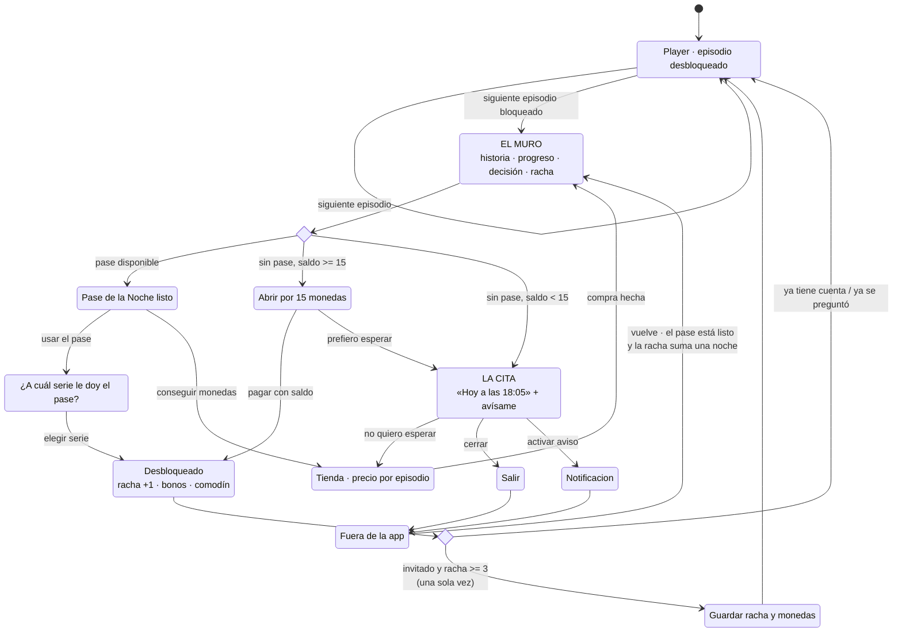

# 3. La intervención en profundidad

# «Continuará» — el Pase de la Noche

> **Una frase:** el muro de desbloqueo deja de ser el final de la sesión y pasa a ser una cita con hora, en la historia que el usuario ya está viendo.

**En este apartado:** la justificación de la elección · la mecánica · el diagrama de flujo · ocho decisiones de diseño · la revisión crítica del precedente · el modelo económico · los riesgos técnicos.
**Además:** [el archivo de diseño](pencil/) (6 pantallas + hoja de sistema), [el sistema visual](sistema.md) (42 tokens, 7 componentes, y cómo llevarlo a Figma) y [`tokens.json`](tokens.json).

---

## 3.1 Por qué esta intervención y no otra

De las ocho intervenciones de la estrategia, elegí esta por cuatro razones, en orden de peso.

**1. Es la única que ataca el punto exacto donde la sesión se corta por precio.**
Toda serie con muro empieza igual —10 episodios gratis, 15 monedas por episodio después—, así que el corte no es un accidente: es la estructura del catálogo y siempre cae en el mismo lugar. Que la sesión promedio de 14 episodios termine justo ahí es la hipótesis que plantea el diagnóstico, no un hecho: 14 es una media y no se descompone. Pero el corte existe con o sin esa cuenta, y no lo pone el aburrimiento — lo pone el precio. Cualquier intervención que no toque ese segundo está optimizando alrededor del problema.

**2. Es la única que puede mover DAU/MAU por sí sola.**
Stickiness es una métrica de *regreso*. Para moverla hace falta una razón concreta para volver mañana. El muro es el único momento del producto donde el usuario quiere algo que no puede tener — el único donde una promesa a futuro tiene valor real. Legibilidad de la moneda (I1) y progresión visible (I6) hacen mejor producto, pero no crean regreso.

**2bis. Y es la única que compite contra lo que el usuario realmente hace.**
El censo del catálogo mostró que la alternativa a pagar no es irse: es **empezar otra de las 50 series y comerse sus 10 episodios gratis**. Eso es lo que gana hoy, y sale gratis. El Pase de la Noche es lo único en todo el producto que ofrece algo que ese camino no puede dar: **seguir donde estabas**. Empezar otra serie te devuelve al episodio 1 de una historia que todavía no te importa; el pase te devuelve al episodio 11 de la que sí.

Por eso la elección entre series (R2) no es solo pedagógica. Es el momento en que el usuario **declara cuál historia le importa** — que es exactamente el apego que hoy no existe y que la métrica de stickiness necesita.

**3. Resuelve el objetivo de experiencia como efecto secundario, no como pantalla aparte.**
El brief pide que el usuario entienda el valor de la moneda, sus fuentes, sus sumideros y su posición. La tentación es una pantalla que lo explique. Nadie lee esa pantalla. Aquí el usuario aprende el sistema porque tiene que **operarlo**: recibe un recurso escaso (un pase), decide dónde gastarlo (qué serie), ve el efecto (episodio abierto, racha +1) y ve el precio de la alternativa ($0.15 por episodio, el peldaño regular de la tienda). Es aprendizaje por uso.

**4. Funciona para el 88% que es invitado, desde el día uno.**
Sin cuenta, sin onboarding, sin perfil. El estado vive en el dispositivo y se ofrece migrar a cuenta solo cuando ya vale la pena.

**Lo que descarté con más pena:** el rediseño de la recompensa diaria como intervención independiente. Es más barato (2 semanas contra 5) y probablemente sube el reclamo del 19% a algo mucho mayor. Pero deja intacto el hecho de que la razón para volver sigue siendo una moneda abstracta y un calendario, no la historia. Sube una métrica intermedia sin cambiar el mecanismo. Terminó absorbido como I2 dentro de la Ola 1 y como el reclamo inline del pase.

---

## 3.2 La mecánica en cinco reglas

**R1 · No hay nada que reclamar. El Pase se acredita al terminar un episodio.**
Una vez por noche, al terminar el primer episodio, se acredita el Pase, avanza la racha y se paga el bono si toca. El usuario no toca nada: un toast de dos segundos se lo dice y sigue viendo.

Es la corrección directa al **19% de reclamo** de la recompensa diaria. Ese 19% no es un problema de diseño de pantalla — es la consecuencia de haber puesto un botón entre el usuario y algo que ya se ganó. Quitando el botón, la adopción de la fuente pasa a ~100% **por construcción**.

> Esta regla no estaba en mi primera versión: la acreditación colgaba de un reloj de 24 h. La tomé de la versión paralela de este mismo reto, donde está mejor resuelta. El razonamiento completo está en [`RECONCILIACION.md`](../RECONCILIACION.md).

**R1b · Los pases se guardan hasta dos.**
El techo de emisión es duro y por usuario, no por serie: uno por noche, máximo 7 por semana. El tope de acumulación en **2** cubre el caso de quien ve episodios gratis, recibe el pase y cierra la app sin llegar al muro. Se explica en §3.4bis.

**R2 · El usuario elige a qué serie se lo da.**
Con dos o más series empezadas, usar el pase abre una elección. Esta regla parece un detalle y es el centro pedagógico de todo: obliga a razonar sobre un recurso escaso. Un recurso que se asigna se entiende; uno que se recibe, no.

**R3 · La unidad es la noche, y la noche corre de 5 a.m. a 5 a.m.**
54% de las sesiones pasan entre 11 p.m. y 2 a.m. Con corte a medianoche, ver el martes a las 23:40 y el miércoles a las 00:20 cuenta como una sola visita y el martes queda roto. Con corte a las 5 a.m., son dos noches — que es como el usuario las vivió. El corte se calcula en la zona horaria del usuario, nunca en UTC.

**R4 · Un comodín, ganado en la noche 3, que se consume solo.**
Un usuario de 2.3 días por semana no puede sostener 7 de 7. El comodín absorbe una falta sin que haya que reclamarlo, comprarlo ni enterarse. Se recarga al completar el ciclo de 7 noches.
*La regla detrás de la regla: si hay que hacer algo para no perder la racha, la racha ya es una tarea.*

**R5 · La escalera de la racha paga en pases, no en monedas.**
Todo se acredita solo, al ver. La tabla es lo que llega cada noche sin pedir nada:

| Noche | 1 | 2 | 3 | 4 | 5 | 6 | 7 |
|---|---|---|---|---|---|---|---|
| Pase | ✓ | ✓ | ✓ | ✓ | ✓ | ✓ | ✓ |
| Monedas | — | — | +30 | — | +45 | — | +75 |
| Comodín | — | — | ✓ | — | — | — | — |

Las monedas solo aparecen en las noches 3, 5 y 7 — es decir, solo para quien ya volvió varias veces. El grueso del valor está en el pase, que tiene techo duro.

---

## 3.3 El flujo

**El arco que importa es el de abajo a la derecha.** Hoy ese camino termina en `Fuera de la app` y no vuelve. La intervención entera existe para dibujar la flecha de regreso, y para que esa flecha tenga una hora concreta en vez de una esperanza.

---

## 3.4 Las decisiones de diseño, una por una

### D1 · El muro se ordena por la historia, no por el precio

De arriba a abajo: **cliffhanger → dónde voy → lo gratis → lo pago → mi racha.**

El paywall actual abre con `Costo del episodio: 15 / Tu balance: 0`. Eso enseña, en el primer segundo, que el sistema es una tienda y que el usuario no tiene con qué. La propuesta abre con *«Camila abre la puerta y el que está del otro lado no es Andrés»*.

No es adorno narrativo. Es que el usuario llegó ahí por la historia, y el muro es el único lugar del producto donde recordárselo tiene consecuencia económica: el deseo es el que le da valor a la moneda. Un muro que arranca con precios está vendiendo antes de haber recordado qué se vende.

### D2 · Lo gratis siempre va arriba de lo pago

El pase ocupa la posición primaria; comprar es un botón debajo. Es una decisión con costo de ingreso a corto plazo y la defiendo por dos razones:

1. El 95%+ de la base no paga. Para ellos, un muro que solo vende es un muro sin salida, y el resultado es abandono, no conversión.
2. El usuario que sí iba a pagar sigue pagando: la salida de compra está siempre, y lo que cambia es su peso según el estado del muro. Sin pase y sin saldo es un botón entero, *«No quiero esperar»*. Con saldo suficiente es *«Abrirlo ahora por 15 monedas»*. Y con un pase disponible baja a un link chico debajo del pase, *«o consigue monedas para no esperar»* — porque ahí estaría compitiendo contra algo gratis que el usuario ya tiene en la mano. En los tres casos el precio llega con más información que antes (sabe que un episodio cuesta $0.15 y que la alternativa es esperar hasta las 18:05). Un precio con alternativa visible se juzga mejor que un precio sin ella.

La contrapartida honesta: si el guardrail de ARPDAU cae más de 8% de forma sostenida, esta jerarquía es lo primero que hay que revisar.

### D2b · La cita se ancla a la hora de siempre, no a «+24 h desde que lo usaste»

Mi primera versión ponía el próximo pase 24 horas después del último uso, así que la cita caía a una hora arbitraria: si usaste el pase a las 18:05, mañana a las 18:05.

Ahora se ancla a **la hora en que ese usuario suele ver**. El sistema ya lo sabe —el 54% de las sesiones cae entre 11 p.m. y 2 a.m., y cada usuario tiene su franja dentro de eso— y no usarlo era desperdiciar el único dato que vuelve creíble una cita.

*«Mañana a las 21:30, tu hora de siempre»* es una promesa que encaja en una vida real. *«Mañana a las 18:05»* es el residuo de un temporizador.

### D3 · El héroe del estado de espera es la hora del reloj, no el countdown

Esta decisión salió de usar el prototipo. La primera versión mostraba `17h 47m 03s` en grande. Se siente mal: nadie mira 17 horas correr, y un contador enorme de dos dígitos de horas comunica *«falta muchísimo»*, que es exactamente el mensaje contrario al que se busca.

La versión final muestra **`HOY A LAS 18:05`** en grande y `faltan 17 h 47 m` debajo. Una hora concreta se puede agendar mentalmente; un intervalo largo solo se puede sufrir.

El countdown vuelve a ser el héroe cuando falta menos de una hora — ahí sí los segundos son la información relevante y la urgencia es real.

### D4 · La moneda nunca viaja sola

En todo el producto, cada cifra en monedas lleva su traducción a episodios:

| Superficie | Antes | Después |
|---|---|---|
| Chip de saldo | `2543` | `90` · *6 episodios* |
| Muro | `Tu balance: 0` | *Te faltan 15 monedas para este episodio* |
| Tienda · oferta de bienvenida | `180 monedas · $0.99` | **12 episodios** · 180 monedas · **$0.08 por episodio** |
| Paquete grande | `375 monedas · $3.99` | **44 episodios** · *Termina esta serie* · $4.99 |

El caso de *«Termina esta serie»* es el que más me gusta, y es el que más cambió al medir el catálogo.

La primera versión ponía esa etiqueta fija sobre el paquete de 660 monedas, porque *Pasión a Domicilio* cuesta exactamente eso. Al censar las 50 series resultó que van de **150 a 960 monedas**. La lectura que importa no es cuántas veces el número no coincide —eso pasa en 40 de las 41 series con muro y es trivial—, sino cuántas veces **el badge promete algo que la compra no cumple**: en **19 de esas 41 series, el 46%, el paquete de 660 no alcanza para terminar la serie**. Un badge que promete de más en casi la mitad de las compras no es un badge, es un problema de confianza en el momento de pagar — justo el defecto que le señalo al paywall actual.

Ahora se calcula. La tienda abre con la meta real de la serie que el usuario está viendo — *«Para terminar Pasión a Domicilio: 44 episodios · 660 monedas»* — y el badge cae sobre el paquete más chico que alcanza. O es cierto, o no aparece.

### D5 · La escalera de precios se corrige para que subir tenga sentido

Hoy, en el producto: $1.99 → 180 monedas (90.5 por dólar) y $3.99 → 375 (94.0). Subir de escalón mejora el valor 3.9%.

Propuesta, medida en la unidad que el usuario entiende:

| | Episodios | Precio | Por episodio |
|---|---|---|---|
| Bienvenida (una vez) | 12 | $0.99 | **$0.08** |
| — | 13 | $1.99 | $0.15 |
| Termina esta serie *(calculado)* | 44 | $4.99 | $0.11 |
| — | 100 | $9.99 | $0.10 |

Fuera de la oferta de bienvenida, el precio por episodio baja en cada escalón.

Que la bienvenida no rompa esa lógica no puede quedar en la declaración: puestas una al lado de la otra, $0.99 por 12 episodios y $1.99 por 13 son un dólar más por un episodio más, exactamente la lectura de *«error o trampa»* que le señalo al producto en F3. Por eso hace falta una **regla de producto, no una aclaración de copy: la bienvenida nunca comparte grilla con la escalera.** Se muestra sola, la primera vez que el usuario abre la tienda, como tarjeta única y con vencimiento declarado; la escalera completa recién aparece cuando la bienvenida se usó o se venció. Los dos precios no llegan a verse juntos nunca.

**Y se van todos los precios tachados, incluido el de la oferta de bienvenida.**

Hoy los cuatro paquetes llevan badge de descuento a la vez (60%, 20%, 20%, 30%) contra anclas de $2.49 y $4.99. Cuando todo está rebajado, el ancla deja de anclar y empieza a restar confianza justo en el segundo de pagar.

Mi primera versión conservaba el tachado en la oferta de bienvenida, que parecía inofensivo. No lo es: en la escalera propuesta **no existe un paquete de 180 monedas a precio regular**, así que $2.49 anclaría contra un producto inventado. Es el mismo patrón que critico, con mejor coartada.

La columna de precio por episodio hace el trabajo sola y sin mentir: **$0.08 contra $0.15** dice exactamente lo que el tachado pretendía decir.

### D6 · El oro está racionado

En toda la paleta, el único acento cálido de alta luminancia es el oro (`#FFC53D`), y está reservado a dos cosas: la moneda y el Pase. Nada más.

A la 1 a.m., con el brillo bajo, la atención va donde está la luz. Si el oro se usara también para avisos, badges y promociones, el usuario dejaría de saber qué significa. Racionarlo lo convierte en un idioma: *dorado = esto es tuyo o puede serlo.*

Por la misma razón el blanco máximo es `#F2EBF7` y no `#FFFFFF` — un 8% menos de luminancia que se agradece en la franja de las 11 p.m. a las 2 a.m., que es más de la mitad de las sesiones.

### D7 · La cuenta se pide una sola vez, y tarde

Sin muro de registro. El prompt aparece **una vez**, después de un desbloqueo, cuando el invitado ya tiene 3+ noches de racha y saldo. El argumento no es *«crea tu cuenta»* sino *«no pierdas estas 4 noches y estas 75 monedas»*: se muestran las tres cifras que están en juego.

Solo correo. Sin contraseña, sin perfil, sin foto. Todo lo que se pida de más en ese momento es fricción sobre una decisión que ya cuesta.

### D8 · Qué NO se agregó

| Idea | Por qué no |
|---|---|
| Tab de "Recompensas" rediseñado | Es exactamente el error que estamos corrigiendo: mover el metajuego a un destino. |
| Barra de progreso semanal en el player | El player debe seguir siendo video. El único elemento de meta permitido ahí es el chip de saldo. |
| Racha visible en el home | El usuario nocturno entra y toca "seguir viendo". Una racha en el home la ve tarde o no la ve. |
| Anuncio recompensado para ganar un pase extra | Rompería el techo duro de 1 pase / 24 h, que es lo que hace sostenible la economía. Es, además, la fuente que ya usan ReelShort y DramaBox — DramaBox hasta 15 anuncios diarios ≈ 6 episodios gratis por día. Que la categoría lo haga es argumento para probarlo, no para meterlo en esta intervención: cambia la naturaleza del producto y es una decisión de negocio. Lo señalo, no lo decido. |
| Compartir la racha | 88% invitados, consumo solitario y nocturno, contenido con carga de pudor. No hay a quién mostrarle. |

---

## 3.4bis · El precedente, revisado en contra

Cuando escribí la primera versión de este documento apoyé la mecánica en el **Daily Pass de Webtoon**, la referencia canónica de "esperar o pagar" en contenido serializado. Fui a verificarlo y encontré que **el precedente falló**. Vale la pena dejar el error a la vista, porque corregirlo cambió el diseño.

### Qué pasó realmente

| | |
|---|---|
| **2020** | Webtoon lanza Daily Pass: 1 episodio gratis por día de series **ya terminadas**, con acceso de 14 días. |
| **2022** | Se extiende a algunos títulos en emisión. |
| **Mayo 2025** | Webtoon **retira** Daily Pass sin explicación detallada. Lo reemplaza con Ad Pass (ver anuncio para desbloquear, expira a los 3 días) y compra con monedas. |

La queja dominante de los lectores durante los cinco años de vida de la mecánica —hubo hasta una petición pública para eliminarla— fue siempre la misma: **convertía la lectura en una tarea diaria**. "La gracia del webtoon es maratonearlo; si no puedo, me voy a otro lado."

*(Nota de rigor: la MAU global de Webtoon cayó 7.1% en 2025. **No** atribuyo esa caída al retiro del Daily Pass — el retiro fue en mayo y la caída es del año completo. Sería exactamente el mismo error de causalidad que le señalo al 2.4x de D30.)*

### Por qué la crítica no aplica igual aquí — y en qué sí aplica

**Dónde no aplica.** El Daily Pass de Webtoon era **restrictivo**: tomaba contenido que el lector podía consumir de corrido y lo racionaba a uno por día. La mecánica *era* el techo de consumo, y por eso se sentía como un peaje.

El Pase de la Noche es **aditivo**. El muro de Idilio ya existe: 10 gratis y 15 monedas por episodio a partir de ahí. El pase no le quita nada a nadie — agrega un desbloqueo gratis encima de un paywall que no cambia. **No puede convertir el maratón en tarea porque no es el pase el que corta el maratón: eso ya lo hace el precio.** La comparación correcta no es "pase contra maratón libre", es "pase contra pantalla sin salida".

**Dónde sí aplica, y qué cambié por eso.** El mecanismo psicológico que hundió al Daily Pass no era solo la restricción: era el **"úsalo o piérdelo"**. Un recurso que caduca cada 24 h no se siente como un regalo, se siente como un turno que hay que ir a marcar. Mi primera versión tenía exactamente eso: *"no se acumula, el que no se usa se pierde"*.

Es la misma trampa que ya identifiqué en el diagnóstico con la racha diaria, y la había vuelto a poner en la mecánica sin darme cuenta.

**El arreglo, en dos partes.** La primera fue cambiar *cuándo* se acredita: al ver, no por reloj — con lo que el recurso nunca llega en ausencia del usuario y la caducidad deja de tener sentido como castigo. La segunda, los pases se guardan hasta dos:

| | Tope 1 (úsalo o piérdelo) | Tope 7 (acumulación libre) | **Tope 2** |
|---|---|---|---|
| Faltar una noche | Cuesta un episodio | No cuesta nada | **No cuesta nada** |
| Volver seguido rinde más | Sí | **No** — da igual entrar 1 vez que 7 | **Sí** — 2 noches → 4 eps; 4+ noches → 7 |
| Se siente como | Turno que marcar | Buzón que vaciar | Algo que te espera |

El tope 2 es el único punto donde el castigo desaparece y el gradiente de incentivo sobrevive. Y encaja con el comodín: **el sistema perdona exactamente una falta, en las dos dimensiones.**

> **Posdata honesta.** Cuando escribí esta sección creía que la caducidad era el error y el tope la solución. Al leer la versión paralela del reto entendí que la caducidad solo es un problema **si el recurso se acredita por reloj** —porque entonces puede llegar cuando el usuario no está—. Acreditando al ver, caducar y topar cumplen la misma función. Cambié la acreditación por eso; el tope se queda porque cubre un caso que la caducidad no cubre: ver gratis, recibir el pase y cerrar la app sin llegar al muro.

### Dónde el precedente sí sostiene la apuesta

La categoría directa —no cómics, microdramas— ya validó que la fuente gratuita recurrente convive con la monetización. Según fuentes secundarias del sector (**a verificar contra datos propios antes de usarlas para calibrar**):

| | ReelShort | DramaBox | **Idilio (hoy)** | **Idilio (propuesta)** |
|---|---|---|---|---|
| Check-in diario | ~10 monedas | Sí, y **la racha se rompe al faltar** | Sí, lo reclama el 19% | Pase de la Noche, en el muro |
| Anuncios recompensados | Sí | Hasta 15/día ≈ **6 episodios diarios** | No | No (fuera de alcance) |
| Costo de una serie | $37–47 (80 eps) | — | **~$6.63** (serie mediana, 50 eps) | igual |

Dos lecturas que salen de ahí:

1. **Lo que propongo es conservador para la categoría.** 4 episodios gratis por semana para el usuario promedio, contra los ~6 *diarios* que DramaBox regala por ver anuncios. El riesgo de vaciar la economía es bajo en términos relativos al mercado.
2. **DramaBox rompe la racha al faltar un día, igual que Idilio.** Es el estándar de la categoría, y es el estándar que este diseño decide no seguir. Que todos lo hagan no lo vuelve correcto para una base que entra 2.3 días por semana.
3. **Idilio es unas 3 veces más barato por episodio bloqueado que los líderes.** Hay que normalizarlo, porque las series no miden lo mismo: los $37–47 de ReelShort son por una serie de 80 episodios, o sea **~$0.46–0.59 por episodio**; los $6.63 de la serie mediana de Idilio son por 40 episodios bloqueados, o sea **~$0.17**. Comparados en bruto la brecha parece de 5 a 7 veces; por episodio, que es la unidad que el usuario paga, son unas 3. Si el dato se confirma con cifras propias, el margen para regalar episodios sigue siendo *menor* de lo que sugiere la comparación bruta: cada episodio regalado pesa más sobre un ARPU más bajo. Es un argumento para mantener el tope en 2 y no subirlo.

---

## 3.5 Modelo económico: por qué esto no rompe la economía

La restricción del brief es explícita: *«cualquier fuente nueva de moneda debe equilibrarse con la sostenibilidad de la economía y con la conversión a pagador»*.

**Primero: no es una fuente nueva.** La recompensa diaria ya existe. Lo que cambia es dónde se reclama y en qué unidad se entrega. Que suba el reclamo del 19% a algo mucho mayor sí aumenta la emisión total — eso es real y hay que medirlo. Pero el diseño de fuente no se amplía, se relocaliza.

**Segundo: el techo es duro y es por usuario.**

| Noches que entra | Pases recolectados | Bonos | Episodios gratis / semana | Monedas emitidas |
|---|---|---|---|---|
| 2 (promedio real, DAU/MAU 0.33) | 4 | 0 | **4** | 60 |
| 3 | 6 | 30 | **8** | 120 |
| 5 | 7 *(tope de emisión)* | 75 | **12** | 180 |
| 7 (asistencia perfecta) | 7 *(tope de emisión)* | 150 | **17** | 255 |

Con acumulación hasta 2, quien entra N noches recolecta hasta 2N pases — pero la emisión nunca pasa de 7 por semana, porque solo se acredita uno cada 24 h. Por eso las filas de 5 y 7 noches convergen: **el techo lo pone el reloj, no la asistencia.**

El usuario promedio de hoy — 2.3 noches por semana — recibe **4 episodios gratis por semana**. En la serie mediana del catálogo (50 episodios, 40 bloqueados) eso es el 10% del contenido pago de un solo título, y el 0.2% de los 1.728 episodios bloqueados del catálogo. No es una economía que se vacía; es un goteo que compra un regreso.

*Promedio, no mediana: 2.3 sale de 0.33 × 7, que es una media. La precisión importa porque toda la fila de cabecera de la tabla cuelga de ahí — y juega a favor, porque con la cola pesada que tiene la asistencia la mediana real está por debajo de 2.3. El modelo se equivoca del lado seguro.*

**Y hay que ponerlo en perspectiva, con cuidado:** el catálogo ya regala 500 episodios, pero ese colchón es un **stock** —se agota una vez y no vuelve— y el pase es un **flujo**: unos 208 episodios al año para el usuario promedio, todos los años. Dividir uno por otro (208 sobre 500, un 42%) queda prolijo y no dice nada: a tres años el pase entregó 600 y el colchón sigue siendo 500. La comparación honesta es contra el flujo que sí corresponde — los **1.728 episodios bloqueados** que el usuario tiene por delante, que al ritmo del pase tarda más de ocho años en abrir. Solo igualar el colchón le lleva **2.4 años**.

Pero la sostenibilidad no cuelga de ninguna de esas comparaciones, y por eso no las uso para defenderla. Cuelga del **techo duro: 7 pases por semana y por usuario**, sin anuncios que lo levanten ni forma de comprar más. Ese techo vale sea grande o chico el colchón, y es lo único que hace falta para acotar la emisión. Lo que el colchón no tiene y el pase sí es dirección: estos episodios van a la historia que el usuario eligió, no a diez arranques distintos.

**El gradiente que sostiene DAU/MAU:** entrar 2 noches rinde 4 episodios; entrar 4 o más rinde 7. Volver seguido sigue siendo estrictamente mejor. Si el tope fuera 7 en vez de 2, acumular la semana entera y entrar un solo día daría lo mismo que entrar todos los días — y la mecánica dejaría de mover la métrica que existe para mover.

**Tercero: el riesgo de canibalización está concentrado y es medible.**
Vive en la cola de asistencia perfecta (17 eps/semana ≈ $1.90 de valor a precio de escalera), que es justamente la población con más probabilidad de pagar. Es un riesgo real y lo digo antes de que aparezca en el dashboard.

Tres palancas, en orden de uso si el guardrail se dispara:
1. Bajar los bonos de las noches 5 y 7 (−45, −75). Deja los pases intactos, que son el mecanismo de regreso.
2. Hacer que el pase abra solo el *siguiente* episodio de la serie y nunca uno adelantado. (Ya está así.)
3. Restringir el pase a series donde el usuario ya agotó los episodios gratis. (Ya está así.)

**Guardrail y criterio de kill:** ARPDAU medido contra holdout. Si cae más de **8% relativo sostenido durante 2 semanas**, se revierte y se prueba con la palanca 1.

**Cuarto — el argumento que creo más fuerte, y que es una hipótesis, no un hecho:**
un usuario frente a un countdown que dice *«a las 18:05»* está **más cerca de pagar** que uno frente a una tienda sin alternativa. La espera hace el precio saliente: $0.15 contra 17 horas es una comparación que se puede hacer; $0.15 contra nada, no.

Es la hipótesis más importante del documento y **no está probada**. El precedente que parecía respaldarla —el Daily Pass de Webtoon— resultó ser un caso retirado, no un caso de éxito (§3.4bis). Lo que sí está documentado en la categoría es que la fuente gratuita recurrente convive con la monetización: ReelShort y DramaBox, que juntos concentran el grueso del mercado de microdramas, operan con check-in diario y anuncios recompensados mucho más generosos que este pase.

Esto es exactamente lo que mide el experimento de I5. Si el countdown no acerca a pagar, el guardrail de ARPDAU lo va a mostrar en dos semanas.

---

## 3.6 Viabilidad: los tres riesgos técnicos

**1. El reloj tiene que vivir en el servidor.**
Un countdown en cliente se rompe cambiando la hora del teléfono. El cliente debe mostrar un delta contra `server_time` y el desbloqueo debe validarse del lado del servidor. Presupuestado.

**2. La ventana de 5 a.m. se calcula en la zona del usuario.**
México, Colombia y el público hispano de EE. UU. cruzan cuatro husos horarios. Si el corte se calcula en UTC, a un usuario de Los Ángeles la racha se le rompe a las 10 p.m. Es una decisión de producto disfrazada de detalle técnico: hay que fijarla antes del primer endpoint.

**3. Push es el 40% del valor del pase y hoy no llega al 88% de la base.**
El botón *«Avísame cuando esté listo»* es lo que cierra el ciclo: sin él, la cita depende de que el usuario se acuerde. iOS y Android permiten push anónimo por token de dispositivo, así que se puede lanzar sin cuenta — pero el valor completo (cross-device, recuperación de racha, segmentación) llega con I7.

**Fuera del trimestre:** si el análisis dice que el pase funciona pero que la elección entre series confunde, la versión simplificada — un pase que se aplica automáticamente a la última serie vista — es un fallback de una semana. Pero pierde la parte pedagógica, que es media intervención.

---

## 3.7 Fuentes

**Producto real (primarias, verificadas por mí):**
- Reproductor web de [idilio.tv](https://www.idilio.tv) — catálogo, panel de episodios, muro de bloqueo, autoplay.
- [App Store · idilio tv](https://apps.apple.com/us/app/idilio-tv/id6749875422) — build 1.20.0 (21-ago-2026), capturas oficiales del paywall y del home, release notes.
- [Google Play · Idilio Tv](https://play.google.com/store/apps/details?id=com.stvrae.idilio) — rango de compras dentro de la app.

**Sobre el precedente (secundarias, y las trato como tales):**
- [Comics Beat · WEBTOON removes Daily Pass](https://www.comicsbeat.com/no-youre-not-losing-it-webtoon-got-rid-of-daily-pass-2/) — retiro de mayo 2025 y reacción de lectores.
- [Anime News Network · Webtoon Service Ends Daily Pass Feature](https://www.animenewsnetwork.com/news/2025-06-05/webtoon-service-ends-daily-pass-feature/.225053) — historia de la mecánica desde 2020.
- [The Magic Rain · Webtoon says goodbye to Daily Pass](https://themagicrain.com/2025/06/webtoon-says-goodbye-to-daily-pass-hello-to-new-ways-to-read/) — qué la reemplazó.
- [ipetitions · Remove the Daily Pass feature](https://www.ipetitions.com/petition/remove-webtoon-daily-pass/) — la queja de los lectores, en sus términos.
- [WEBTOON (WBTN) Q4 2025 earnings call](https://www.aol.com/articles/webtoon-wbtn-q4-2025-earnings-232039689.html) — MAU 2025, citado sin atribuirle causa.

**Sobre la categoría (secundarias, de calidad desigual — marcadas como "a verificar" donde se usan):**
- [Filmustage · ReelShort vs DramaBox 2026](https://filmustage.com/blog/short-drama-apps-compared-reelshort-vs-dramabox-in-2026/)
- [Unstar · 5 short drama apps ranked 2026](https://unstar.app/blog/reelshort-dramabox-shortmax-goodshort-flextv-short-drama-apps-ranked-2026)
- [QWE · DramaBox guide: coins vs subscription](https://www.qwe.edu.pl/tutorial/dramabox-guide-coins-vs-subscription/)
- [TopMediai · Ways to earn ReelShort free coins](https://www.topmediai.com/ai-tips/how-to-watch-reelshort-for-free/)
