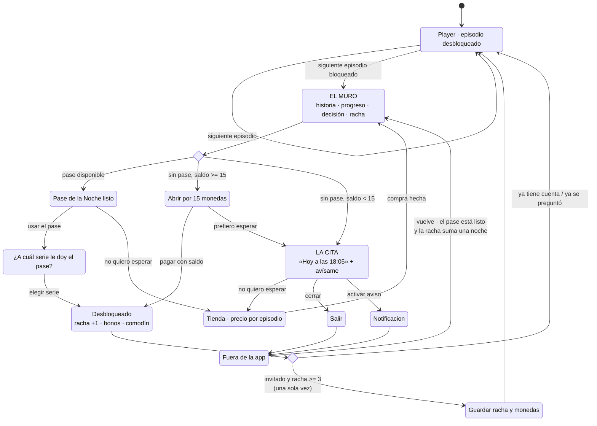

# 3. La intervención en profundidad

# «Continuará» — el Pase de la Noche

> **Una frase:** el muro de desbloqueo deja de ser el final de la sesión y pasa a ser una cita con hora, en la historia que el usuario ya está viendo.

---

## 3.1 Por qué esta intervención y no otra

De las ocho intervenciones de la estrategia, elegí esta por cuatro razones, en orden de peso.

**1. Es la única que ataca el punto exacto donde muere la sesión.**
12 episodios gratis + 14 episodios de sesión promedio = la sesión promedio termina en el muro. Cualquier intervención que no toque ese segundo está optimizando alrededor del problema.

**2. Es la única que puede mover DAU/MAU por sí sola.**
Stickiness es una métrica de *regreso*. Para moverla hace falta darle al usuario una razón concreta para volver mañana. El muro es el único momento del producto donde el usuario quiere algo que no puede tener — es decir, el único donde una promesa a futuro tiene valor real. Legibilidad de la moneda (I1) y progresión visible (I6) hacen mejor producto, pero no crean regreso por sí mismas.

**3. Resuelve el objetivo de experiencia como efecto secundario, no como pantalla aparte.**
El brief pide que el usuario entienda el valor de la moneda, sus fuentes, sus sumideros y su posición. La tentación es una pantalla que lo explique. Nadie lee esa pantalla. Aquí el usuario aprende el sistema porque tiene que **operarlo**: recibe un recurso escaso (un pase), decide dónde gastarlo (qué serie), ve el efecto (episodio abierto, racha +1) y ve el precio de la alternativa ($0.15 por episodio). Es aprendizaje por uso.

**4. Funciona para el 88% que es invitado, desde el día uno.**
Sin cuenta, sin onboarding, sin perfil. El estado vive en el dispositivo y se ofrece migrar a cuenta solo cuando ya vale la pena.

**Lo que descarté con más pena:** el rediseño de la recompensa diaria como intervención independiente. Es más barato (2 semanas contra 5) y probablemente sube el reclamo del 19% a algo mucho mayor. Pero deja intacto el hecho de que la razón para volver sigue siendo una moneda abstracta y un calendario, no la historia. Sube una métrica intermedia sin cambiar el mecanismo. Terminó absorbido como I2 dentro de la Ola 1 y como el reclamo inline del pase.

---

## 3.2 La mecánica en cinco reglas

**R1 · Un Pase de la Noche cada 24 horas.**
Abre un episodio, cualquiera, gratis. No se acumula: el que no se usa se pierde. El techo es duro y por usuario, no por serie — la emisión máxima del sistema es 1 episodio gratis por noche por persona.

**R2 · El usuario elige a qué serie se lo da.**
Con dos o más series empezadas, usar el pase abre una elección. Esta regla parece un detalle y es el centro pedagógico de todo: obliga a razonar sobre un recurso escaso. Un recurso que se asigna se entiende; uno que se recibe, no.

**R3 · La unidad es la noche, y la noche corre de 5 a.m. a 5 a.m.**
54% de las sesiones pasan entre 11 p.m. y 2 a.m. Con corte a medianoche, ver el martes a las 23:40 y el miércoles a las 00:20 cuenta como una sola visita y el martes queda roto. Con corte a las 5 a.m., son dos noches — que es como el usuario las vivió. El corte se calcula en la zona horaria del usuario, nunca en UTC.

**R4 · Un comodín, ganado en la noche 3, que se consume solo.**
Un usuario de 2.3 días por semana no puede sostener 7 de 7. El comodín absorbe una falta sin que haya que reclamarlo, comprarlo ni enterarse. Se recarga al completar el ciclo de 7 noches.
*La regla detrás de la regla: si hay que hacer algo para no perder la racha, la racha ya es una tarea.*

**R5 · La escalera de la racha paga en pases, no en monedas.**

| Noche | 1 | 2 | 3 | 4 | 5 | 6 | 7 |
|---|---|---|---|---|---|---|---|
| Pase | ✓ | ✓ | ✓ | ✓ | ✓ | ✓ | ✓ |
| Monedas | — | — | +30 | — | +45 | — | +75 |
| Comodín | — | — | ✓ | — | — | — | — |

Las monedas solo aparecen en las noches 3, 5 y 7 — es decir, solo para quien ya volvió varias veces. El grueso del valor está en el pase, que tiene techo duro.

---

## 3.3 El flujo

**El arco que importa es el de abajo a la derecha.** Hoy ese camino termina en `Fuera de la app` y no vuelve. La intervención entera existe para dibujar la flecha de regreso, y para que esa flecha tenga una hora concreta en vez de una esperanza.

---

## 3.4 Las decisiones de diseño, una por una

### D1 · El muro se ordena por la historia, no por el precio

De arriba a abajo: **cliffhanger → dónde voy → lo gratis → lo pago → mi racha.**

El paywall actual abre con `Costo del episodio: 15 / Tu balance: 0`. Eso enseña, en el primer segundo, que el sistema es una tienda y que el usuario no tiene con qué. La propuesta abre con *«Camila abre la puerta y el que está del otro lado no es Andrés»*.

No es adorno narrativo. Es que el usuario llegó ahí por la historia, y el muro es el único lugar del producto donde recordárselo tiene consecuencia económica: el deseo es el que le da valor a la moneda. Un muro que arranca con precios está vendiendo antes de haber recordado qué se vende.

### D2 · Lo gratis siempre va arriba de lo pago

El pase ocupa la posición primaria; comprar es un botón debajo. Es una decisión con costo de ingreso a corto plazo y la defiendo por dos razones:

1. El 95%+ de la base no paga. Para ellos, un muro que solo vende es un muro sin salida, y el resultado es abandono, no conversión.
2. El usuario que sí iba a pagar sigue pagando: el botón está ahí, dice *«No quiero esperar»*, y llega con más información que antes (sabe que un episodio cuesta $0.15 y que la alternativa es esperar hasta las 18:05). Un precio con alternativa visible se juzga mejor que un precio sin ella.

La contrapartida honesta: si el guardrail de ARPDAU cae más de 8% de forma sostenida, esta jerarquía es lo primero que hay que revisar.

### D3 · El héroe del estado de espera es la hora del reloj, no el countdown

Esta decisión salió de usar el prototipo. La primera versión mostraba `17h 47m 03s` en grande. Se siente mal: nadie mira 17 horas correr, y un contador enorme de dos dígitos de horas comunica *«falta muchísimo»*, que es exactamente el mensaje contrario al que se busca.

La versión final muestra **`HOY A LAS 18:05`** en grande y `faltan 17 h 47 m` debajo. Una hora concreta se puede agendar mentalmente; un intervalo largo solo se puede sufrir.

El countdown vuelve a ser el héroe cuando falta menos de una hora — ahí sí los segundos son la información relevante y la urgencia es real.

### D4 · La moneda nunca viaja sola

En todo el producto, cada cifra en monedas lleva su traducción a episodios:

| Superficie | Antes | Después |
|---|---|---|
| Chip de saldo | `2543` | `90` · *6 episodios* |
| Muro | `Tu balance: 0` | *Te faltan 15 monedas para este episodio* |
| Tienda | `180 monedas · $0.99` | **12 episodios** · 180 monedas · **$0.08 por episodio** |
| Paquete grande | `375 monedas · $3.99` | **44 episodios** · *Una serie completa* · $4.99 |

El caso de *«Una serie completa»* es el que más me gusta: 44 episodios bloqueados × 15 monedas = 660 monedas. Es una cifra que sale del catálogo real y le da al paquete un significado que el usuario puede evaluar contra algo que quiere.

### D5 · La escalera de precios se corrige para que subir tenga sentido

Hoy, en el producto: $1.99 → 180 monedas (90.5 por dólar) y $3.99 → 375 (94.0). Subir de escalón mejora el valor 3.9%.

Propuesta, medida en la unidad que el usuario entiende:

| | Episodios | Precio | Por episodio |
|---|---|---|---|
| Bienvenida (una vez) | 12 | $0.99 | **$0.08** |
| — | 13 | $1.99 | $0.15 |
| Una serie completa | 44 | $4.99 | $0.11 |
| — | 100 | $9.99 | $0.10 |

Fuera de la oferta de bienvenida, el precio por episodio baja en cada escalón. La oferta de bienvenida queda declarada como tal y no rompe la lógica de la escalera: es una oferta de adquisición, no un peldaño.

Y se van los cuatro badges de descuento simultáneos. Cuando todo está rebajado, el ancla tachada deja de anclar y empieza a restar confianza.

### D6 · El oro está racionado

En toda la paleta, el único acento cálido de alta luminancia es el oro (`#FFC53D`), y está reservado a dos cosas: la moneda y el Pase. Nada más.

A la 1 a.m., con el brillo bajo, la atención va donde está la luz. Si el oro se usara también para avisos, badges y promociones, el usuario dejaría de saber qué significa. Racionarlo lo convierte en un idioma: *dorado = esto es tuyo o puede serlo.*

Por la misma razón el blanco máximo es `#F2EBF7` y no `#FFFFFF` — un 8% menos de luminancia que se agradece en la franja de las 11 p.m. a las 2 a.m., que es más de la mitad de las sesiones.

### D7 · La cuenta se pide una sola vez, y tarde

Sin muro de registro. El prompt aparece **una vez**, después de un desbloqueo, cuando el invitado ya tiene 3+ noches de racha y saldo. El argumento no es *«crea tu cuenta»* sino *«no pierdas estas 4 noches y estas 75 monedas»*: se muestran las tres cifras que están en juego.

Solo correo. Sin contraseña, sin perfil, sin foto. Todo lo que se pida de más en ese momento es fricción sobre una decisión que ya cuesta.

### D8 · Qué NO se agregó

| Idea | Por qué no |
|---|---|
| Tab de "Recompensas" rediseñado | Es exactamente el error que estamos corrigiendo: mover el metajuego a un destino. |
| Barra de progreso semanal en el player | El player debe seguir siendo video. El único elemento de meta permitido ahí es el chip de saldo. |
| Racha visible en el home | El usuario nocturno entra y toca "seguir viendo". Una racha en el home la ve tarde o no la ve. |
| Anuncio recompensado para ganar un pase extra | Rompería el techo duro de 1 pase / 24 h, que es lo que hace sostenible la economía. Además cambia la naturaleza del producto. Se puede probar después, con el guardrail de ARPDAU vigilando. |
| Compartir la racha | 88% invitados, consumo solitario y nocturno, contenido con carga de pudor. No hay a quién mostrarle. |

---

## 3.5 Modelo económico: por qué esto no rompe la economía

La restricción del brief es explícita: *«cualquier fuente nueva de moneda debe equilibrarse con la sostenibilidad de la economía y con la conversión a pagador»*.

**Primero: no es una fuente nueva.** La recompensa diaria ya existe. Lo que cambia es dónde se reclama y en qué unidad se entrega. Que suba el reclamo del 19% a algo mucho mayor sí aumenta la emisión total — eso es real y hay que medirlo. Pero el diseño de fuente no se amplía, se relocaliza.

**Segundo: el techo es duro y es por usuario.**

| Noches que asiste | Pases | Bonos | Episodios gratis / semana | Monedas emitidas |
|---|---|---|---|---|
| 2 (mediana real, DAU/MAU 0.33) | 2 | 0 | **2** | 30 |
| 3 | 3 | 30 | **5** | 75 |
| 5 | 5 | 75 | **10** | 150 |
| 7 (asistencia perfecta) | 7 | 150 | **17** | 255 |

El usuario mediano de hoy — 2.3 días por semana — recibe **2 episodios gratis por semana**. En una serie de 56 episodios con 44 bloqueados, eso es el 4.5% del contenido pago de una sola serie. No es una economía que se vacía; es un goteo que compra un regreso.

**Tercero: el riesgo de canibalización está concentrado y es medible.**
Vive en la cola de asistencia perfecta (17 eps/semana ≈ $1.90 de valor a precio de escalera), que es justamente la población con más probabilidad de pagar. Es un riesgo real y lo digo antes de que aparezca en el dashboard.

Tres palancas, en orden de uso si el guardrail se dispara:
1. Bajar los bonos de las noches 5 y 7 (−45, −75). Deja los pases intactos, que son el mecanismo de regreso.
2. Hacer que el pase abra solo el *siguiente* episodio de la serie y nunca uno adelantado. (Ya está así.)
3. Restringir el pase a series donde el usuario ya agotó los 12 gratis. (Ya está así.)

**Guardrail y criterio de kill:** ARPDAU medido contra holdout. Si cae más de **8% relativo sostenido durante 2 semanas**, se revierte y se prueba con la palanca 1.

**Cuarto — el argumento que creo más fuerte, y que es una hipótesis, no un hecho:**
un usuario frente a un countdown que dice *«a las 18:05»* está **más cerca de pagar** que uno frente a una tienda sin alternativa. La espera hace el precio saliente: $0.15 contra 17 horas es una comparación que se puede hacer; $0.15 contra nada, no. Es el mismo mecanismo del Daily Pass de Webtoon en cómics serializados.
No lo doy por probado. Es exactamente lo que mide el experimento de I5.

---

## 3.6 Viabilidad: los tres riesgos técnicos

**1. El reloj tiene que vivir en el servidor.**
Un countdown en cliente se rompe cambiando la hora del teléfono. El cliente debe mostrar un delta contra `server_time` y el desbloqueo debe validarse del lado del servidor. Presupuestado.

**2. La ventana de 5 a.m. se calcula en la zona del usuario.**
México, Colombia y el público hispano de EE. UU. cruzan cuatro husos horarios. Si el corte se calcula en UTC, a un usuario de Los Ángeles la racha se le rompe a las 10 p.m. Es una decisión de producto disfrazada de detalle técnico: hay que fijarla antes del primer endpoint.

**3. Push es el 40% del valor del pase y hoy no llega al 88% de la base.**
El botón *«Avísame cuando esté listo»* es lo que cierra el ciclo: sin él, la cita depende de que el usuario se acuerde. iOS y Android permiten push anónimo por token de dispositivo, así que se puede lanzar sin cuenta — pero el valor completo (cross-device, recuperación de racha, segmentación) llega con I7.

**Fuera del trimestre:** si el análisis dice que el pase funciona pero que la elección entre series confunde, la versión simplificada — un pase que se aplica automáticamente a la última serie vista — es un fallback de una semana. Pero pierde la parte pedagógica, que es media intervención.
