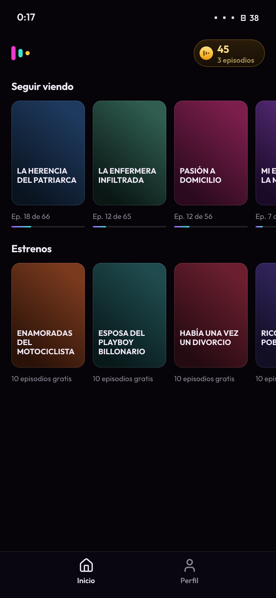
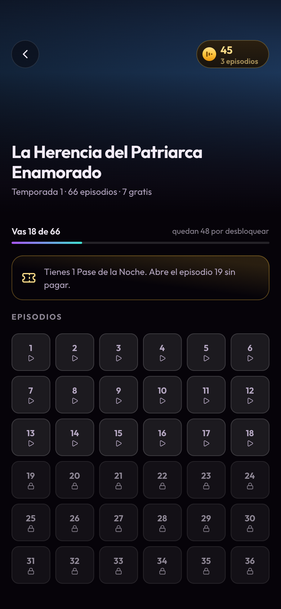
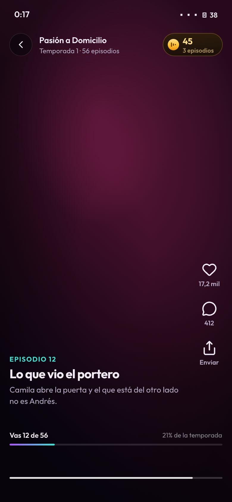
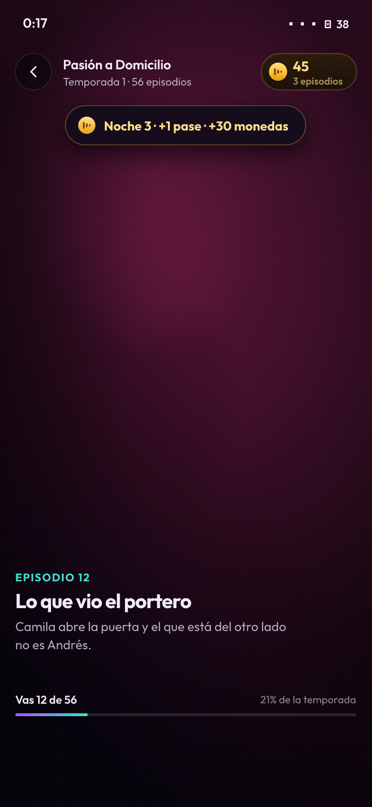
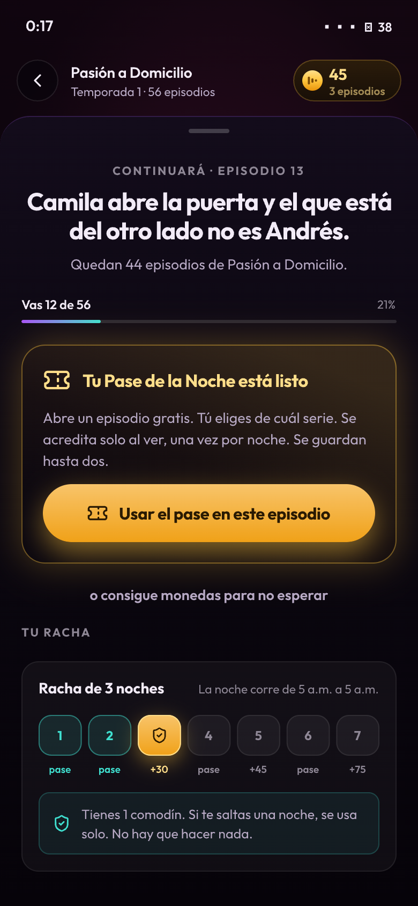
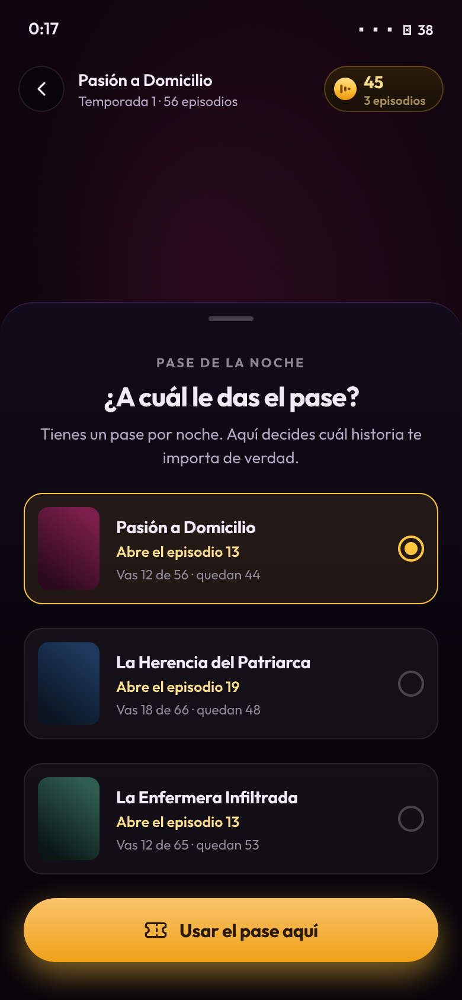
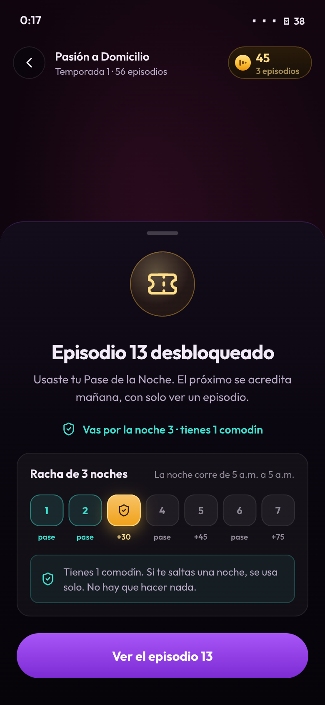
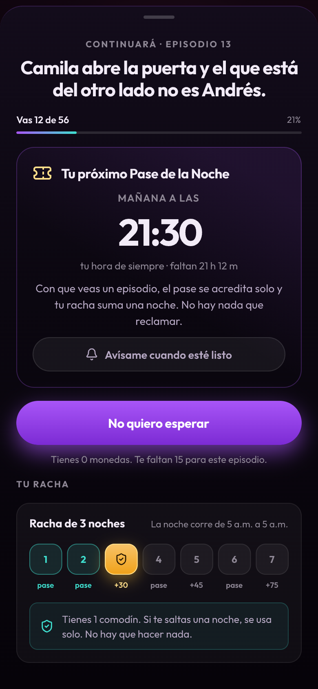
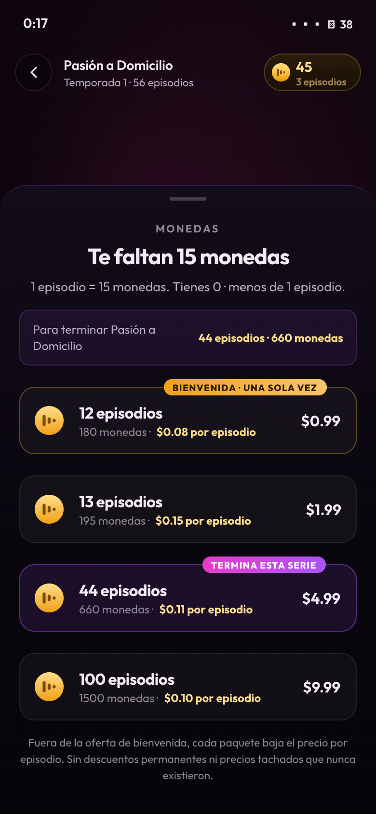
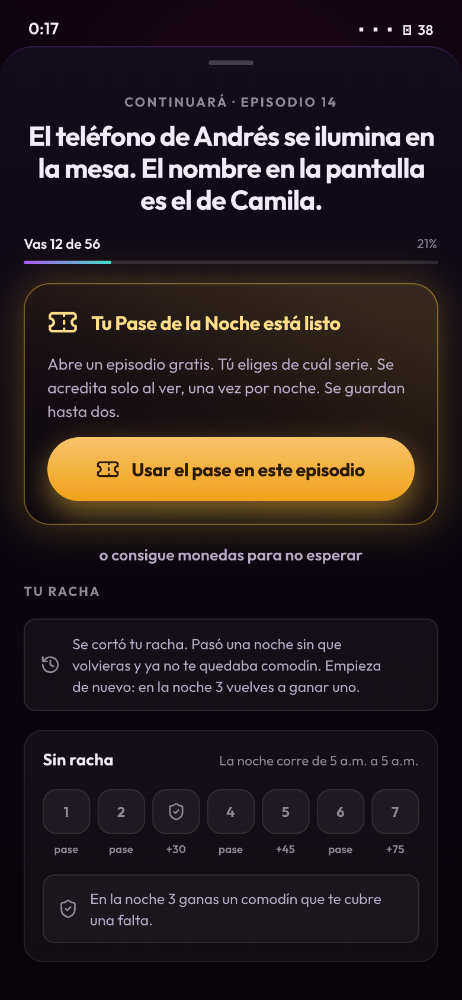

# El archivo de diseño

Las diez pantallas viven en **Figma**, construidas de forma nativa —frames con auto-layout (la
maquetación automática de Figma: los elementos se reacomodan solos), componentes reales,
instancias y variables enlazadas. No son imágenes exportadas de otra parte.

> **[`CCI8plwuWvfTV8VBpowN5X`](https://www.figma.com/design/CCI8plwuWvfTV8VBpowN5X)** — una página
> con tres secciones: **31 variables** —18 de color, 5 de radio y 8 de espaciado— con *scope*
> (dónde se puede usar cada una) y *code syntax* (el nombre que lleva en el código), **9 estilos
> de texto**, **4 componentes** —chip de saldo, tarjeta del Pase, tira de racha y el botón con sus
> cuatro variantes, con 21 instancias repartidas por las pantallas— y **las 10 pantallas**. Las
> variables llevan el *code syntax* apuntando a los tokens (los valores del sistema —colores,
> tipografías, espacios— con nombre propio) reales del prototipo, así que el archivo sirve para
> Dev Mode (el modo de Figma donde quien implementa lee medidas y código).
>
> Los dos artefactos dicen lo mismo, y se puede comprobar: los trece colores que el archivo
> devuelve por su *code syntax* —`var(--tx-lo)`, `var(--violet)`, `var(--cyan)`…— coinciden dígito
> a dígito con `styles.css`, incluido el `#8F8896` de `--tx-lo`, que es el valor **corregido** para
> pasar contraste AA y no el que fallaba. Las 2 de movimiento y las 9 de tipografía no son
> variables: la tipografía vive en los estilos de texto, y las curvas y duraciones en el CSS.

---

## En qué va por detrás del prototipo, y por qué se dice

Los dos archivos son de antes de que las capturas del muro real obligaran a
corregir el diagnóstico. Se quedan como están y la diferencia se declara, que es
más útil que retocarlos y dejar al lector adivinando cuál manda: **el prototipo
es la referencia vigente.** Dos cosas cambiaron después:

| | En los archivos de diseño | En el prototipo hoy |
|---|---|---|
| **El anuncio recompensado** | no aparece | va entre el Pase y el pago, con su tope traducido a *«te quedan 10 episodios gratis hoy»* |
| **La escalera de la racha** | las noches con bono dicen `+30` | dicen `pase +30`: todas las noches dan pase y el bono se **suma** |

Ninguna de las dos toca el sistema —los tokens, los componentes y las variables
son los mismos— y ninguna cambia el orden que la intervención defiende. La
primera añade un renglón dentro del bloque gratuito; la segunda corrige una
etiqueta que hacía leer el bono como si sustituyera al pase.

---

## Las diez pantallas

| | Pantalla | Qué resuelve |
|---|---|---|
|  | **01 · Home** | La estructura del producto tal como es hoy, con el catálogo real. Dos detalles son la propuesta dicha en la navegación: el saldo lleva su traducción a episodios, y **la pestaña «Recompensas» ya no existe** — su contenido se mudó al muro. |
|  | **02 · Ficha de serie** | La pantalla de la app nativa tal como es hoy —«Resumen» con el póster y la lista de «Capítulo N»— y encima lo que la ficha real no dice: dónde vas, qué ya viste y qué abre el siguiente capítulo. Si hay pase disponible, lo dice antes que el precio. |
|  | **03 · Player** | El core loop (lo que el usuario hace una y otra vez: ver un episodio y pasar al siguiente). El muro aparece cuando el siguiente episodio está bloqueado, no antes. |
|  | **04 · El acuse de la noche** | El único momento en que el metajuego aparece dentro del video, y dura dos segundos. Sin botón: la noche se acredita al ver. |
|  | **05 · Muro · el Pase está listo** | El orden que sostiene toda la intervención: historia → posición → gratis → pago → racha. |
|  | **06 · ¿A cuál le das el pase?** | El corazón pedagógico: un recurso escaso que hay que asignar. Aquí el usuario declara cuál historia le importa. |
|  | **07 · Desbloqueado** | La noche 3 en dorado, el bono y el comodín ganado. |
|  | **08 · Muro · la cita** | El héroe es la hora del reloj, anclada a **su hora de siempre**, no a «+24 h». Y el «Avísame», que es lo que cierra el ciclo. |
|  | **09 · Tienda** | Episodios grande, monedas de subtítulo, precio por episodio. La meta calculada de la serie que el usuario está viendo. |
|  | **10 · Se cortó la racha** | El fallo sin castigo: sin rojo, sin alarma y sin oferta para «recuperarla» pagando. |
