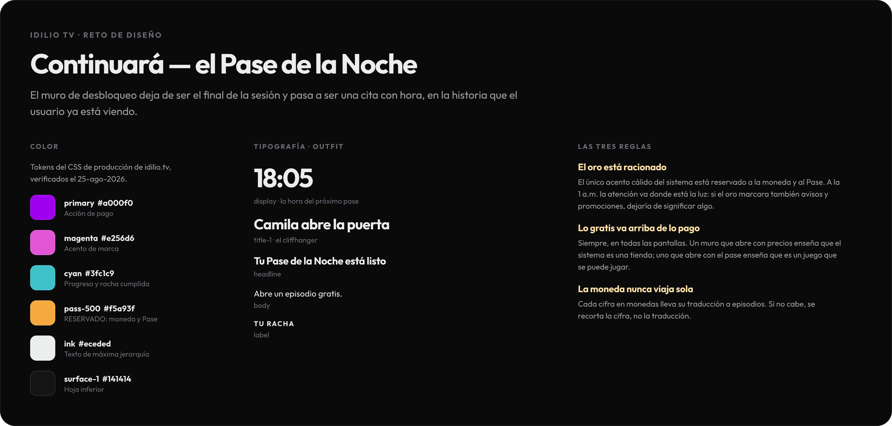
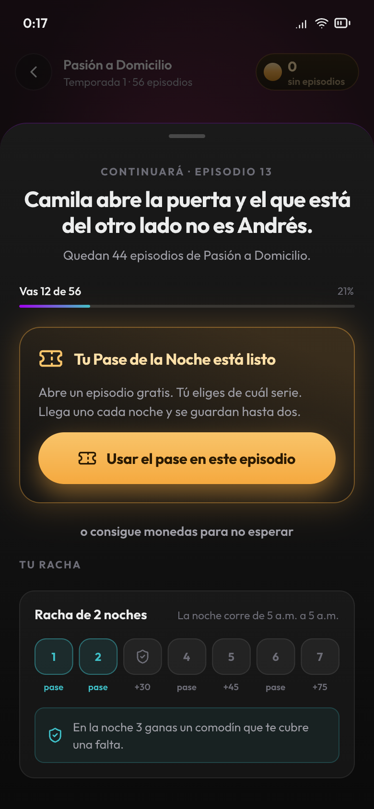
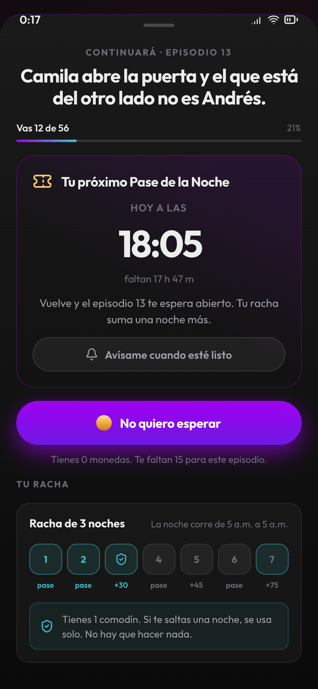
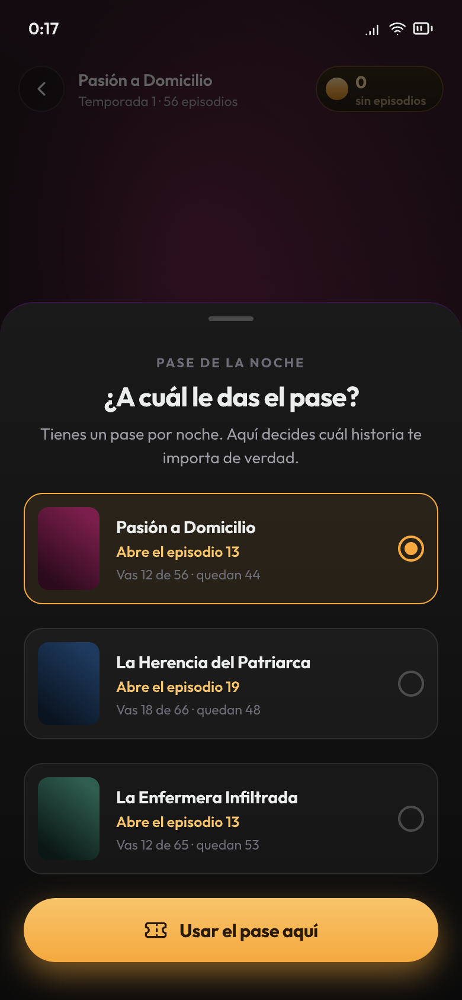
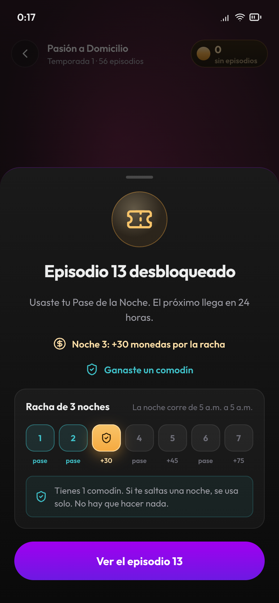
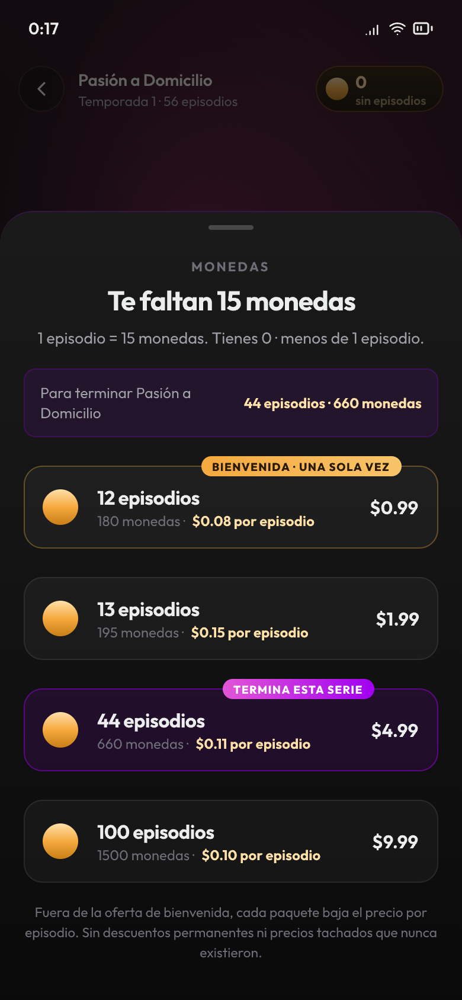
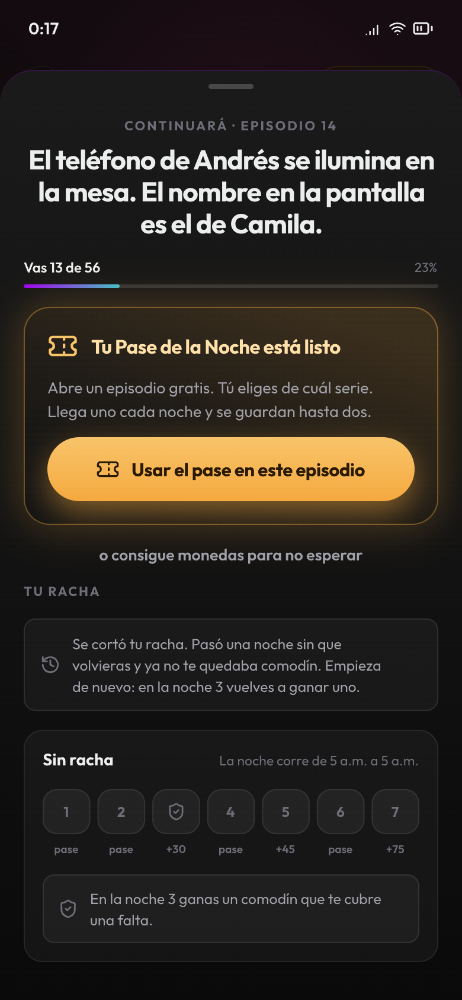

# Archivo de diseño

Seis pantallas más la hoja de sistema, hechas en **Pencil** (`.pen`) sobre los tokens reales
de producción de Idilio TV.

> **Sobre Figma.** El conector de Figma necesita autorización OAuth desde una sesión
> interactiva, y esta no lo es, así que no pude escribir en el archivo compartido. El puente
> está listo para cuando se autorice: [`tokens.json`](../tokens.json) importa a Figma con
> Tokens Studio, y estos PNG a 2× sirven de referencia directa. El detalle está en
> [`sistema.md`](../sistema.md#del-prototipo-a-figma).

| | Pantalla | Qué resuelve |
|---|---|---|
|  | **00 · Sistema** | Los tokens de color con su uso, la escala tipográfica y las tres reglas que gobiernan todo lo demás. |
|  | **01 · Muro · el Pase está listo** | El orden que sostiene la intervención: historia → posición → gratis → pago → racha. |
|  | **02 · Muro · la cita** | El pase ya se usó. El héroe es la hora del reloj, no el countdown, y aparece «Avísame». |
|  | **03 · ¿A cuál le das el pase?** | El corazón pedagógico: un recurso escaso que hay que asignar. Aquí el usuario declara cuál historia le importa. |
|  | **04 · Desbloqueado** | La noche 3 en dorado, el bono de 30 monedas y el comodín ganado. |
|  | **05 · Tienda** | Episodios grande, monedas de subtítulo, precio por episodio. La meta calculada de la serie, y el badge sobre el paquete que de verdad la termina. |
|  | **06 · Se cortó la racha** | El fallo sin castigo: sin rojo, sin alarma y sin oferta para «recuperarla» pagando. |

Regenerar los PNG: exportar los nodos del `.pen` a esta carpeta a escala 2×.
