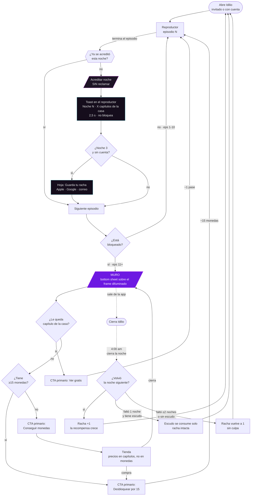

# 4 · Diagrama de flujo

## 4.1 El loop completo, con la economía dentro

## 4.2 Lo que hay que leer en el diagrama

**(a) No existe ninguna rama que diga "reclamar".** La acreditación cuelga de *terminar el episodio*. Ese es el cambio: la fuente dejó de ser un destino al que hay que llegar y pasó a ser una consecuencia de lo que el usuario ya hace.

**(b) El muro tiene tres salidas, y solo una es de pago.** Hoy tiene dos y las dos lo son ("Obtener el pase", "Descargar la app"). La rama gratuita es la que convierte el muro en una clase de economía en vez de una puerta cerrada.

**(c) El nodo de las 4:00 am está en el camino de salida, no en el de entrada.** Es lo que hace que la noche del usuario y la noche del sistema sean la misma cosa.

**(d) El escudo es una rama sin decisión del usuario.** No hay diálogo, no hay confirmación. Se consume y se avisa después. Cada pregunta que le hacemos al usuario sobre su racha es una oportunidad de que piense en abandonarla.

## 4.3 El recorrido de la sesión típica, con números

Sesión promedio observada: **22 min · 14 episodios**. Serie: **30 episodios, 10 libres**.

| Momento | Episodio | Qué pasa | Estado del sheet |
|---|---|---|---|
| 0:00 | 1 | Empieza a ver | — |
| ~1:30 | 1→2 | **Termina el 1º episodio → noche acreditada** | Toast (estado I) |
| 1:30–15:00 | 2–10 | Consume el tramo libre | — |
| ~15:00 | 11 | **Primer muro** | **Estado A** — CTA `Ver gratis` |
| ~16:30 | 12 | **Segundo muro, ya sin pase** | **Estado B** — CTA `Conseguir monedas` |
| ~17:00 | — | Compra o se va | Tienda / salida |

**El muro aparece dos veces en una sesión promedio de la noche 1.** En la noche 7, con 5 pases, aparece por primera vez en el episodio 16 y por segunda en el 17 — sigue apareciendo dos veces, solo que el usuario llegó más lejos y está más enganchado.

Ese es el argumento del §3.3 hecho tabla: **la fuente gratuita no elimina el muro, mueve el muro más adentro de la serie.**
