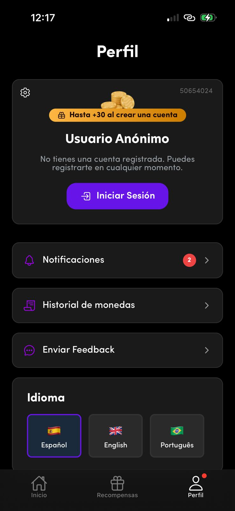
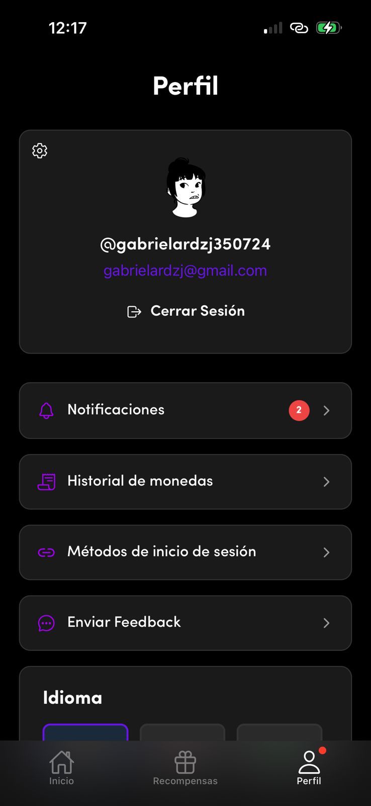
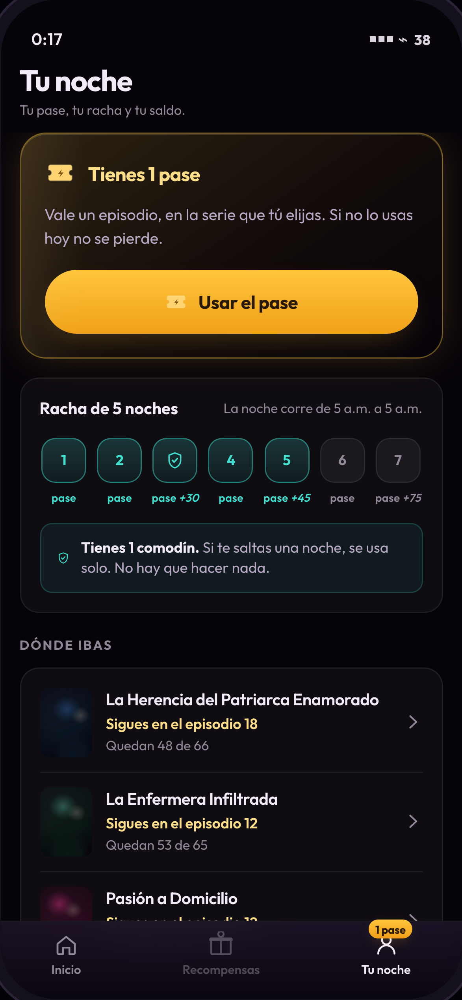
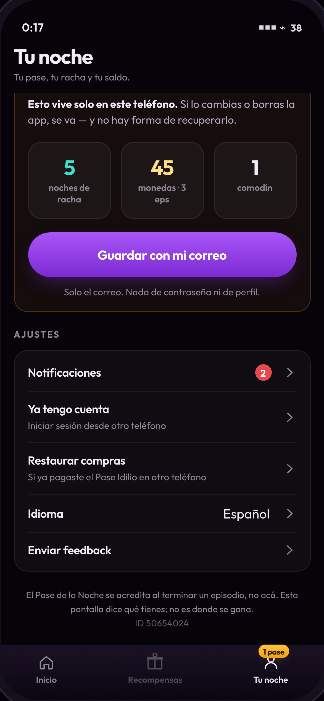
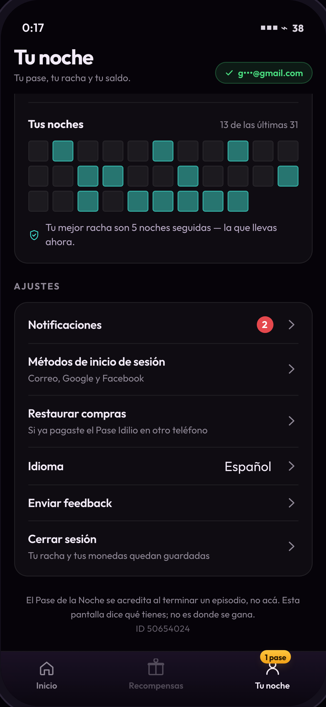
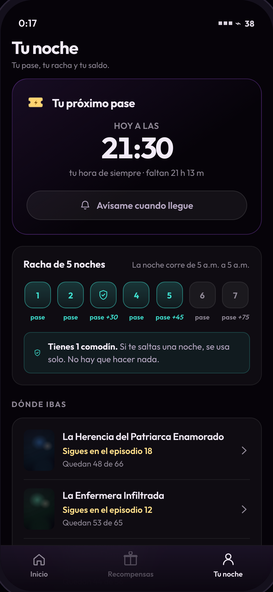

# Anexo 7 · La pestaña del perfil

*Benchmark de cómo diseñan el perfil las plataformas de contenido vertical, y una propuesta en dos estados —sin cuenta y con cuenta— con el argumento de por qué entraría más gente.*

> **Pregunta:** ¿cómo resuelven el perfil las apps de microdrama vertical y sus vecinas, qué hace que alguien entre a esa pantalla, y cómo se rediseña la de Idilio para los dos estados de su base — el 88% que no tiene cuenta y el 12% que sí?
>
> **Método.** Tres capas, y conviene separarlas porque no valen lo mismo:
> 1. **Primaria sobre Idilio** — capturas hechas dentro de la app nativa, ya guardadas en [`docs/00-dogfooding/evidencia`](../00-dogfooding/evidencia/).
> 2. **Documental sobre la competencia** — documentación de los propios productos donde existe. El caso mejor documentado es DramaBox: su política de privacidad describe la arquitectura de su pestaña de perfil ruta por ruta, porque la ley la obliga a decir dónde se ejercen los derechos del usuario. Es la fuente más fiable del anexo y no es un artículo de prensa: es el producto describiéndose a sí mismo.
> 3. **Secundaria** — prensa de industria y teardowns públicos, con su enlace en [§7.9](#79--fuentes).
>
> **Lo que sigue faltando:** los perfiles de ReelShort y DramaBox **con sesión iniciada**. Las webs de esas apps (`reelshort.com`, `goodshort.com`) son sitios de SEO con reproductor, no la app: no tienen la pestaña. Lo que hay de ellas sale de documentación y teardowns.


---

## 7.1 · La contradicción, primero

El diagnóstico de este mismo trabajo **descartó el perfil**, y con un argumento que sigue en pie:

> «El 82% nunca lo abre, así que el alcance máximo de cualquier rediseño es el 18% restante — y ese 18% es, por definición, quien ya navega por su cuenta. Una intervención cuyo techo de alcance es la quinta parte de la base no puede mover una métrica que se calcula sobre la base entera.»
> — [Diagnóstico §1.3](../01-diagnostico/#13-qué-señales-pesaron-y-cuáles-se-descartaron)

Ese argumento no se cae con este anexo, y el documento no lo pretende. Pero la pregunta que responde es otra, y hay que decir la diferencia con precisión:

| | Pregunta | Respuesta |
|---|---|---|
| **Lo que descartó el diagnóstico** | ¿Sirve el perfil como **palanca de engagement**? ¿Se mueve DAU/MAU rediseñándolo? | **No.** El metajuego tiene que ocurrir donde el usuario ya está: el player y el muro. Sigue igual. |
| **Lo que responde este anexo** | ¿Cómo debería estar diseñada esa pantalla, y qué haría que entrara más gente? | Lo que sigue. |

Y una aclaración que hay que hacer antes de proponer nada, porque es la trampa de la pregunta: **«más entradas a una pantalla» no es un buen objetivo por sí solo.** Es una métrica que se puede inflar con un punto rojo y que no significa nada. Un producto de 22 minutos por sesión a la 1 a.m. no gana nada llevando gente a mirar estadísticas.

Así que este anexo persigue dos cosas a la vez, y la segunda manda sobre la primera:

1. **Que entre más gente** — se modela en [§7.6](#76--por-qué-entraría-más-gente-y-cuánta), con su aritmética y sus supuestos.
2. **Que la visita sirva para algo.** Se define una *visita útil* —termina en usar el pase, ver un anuncio, retomar una serie, guardar la cuenta o activar el aviso— y es esa la que se mide. Sin esa definición, el punto 1 es vanidad.

---

## 7.2 · El perfil real de Idilio: las dos capturas

 

*Capturas de la app nativa aportadas el 2-sep-2026, a las 12:17. Son producto, no material de tienda:
[`perfil-nativo-invitado.png`](../00-dogfooding/evidencia/perfil-nativo-invitado.png) · [`perfil-nativo-cuenta.png`](../00-dogfooding/evidencia/perfil-nativo-cuenta.png)*

### Qué hay, bloque por bloque

| | Sin cuenta | Con cuenta |
|---|---|---|
| **Título** | «Perfil», centrado | igual |
| **Tarjeta de identidad** | engranaje · **ID `50654024`** · ilustración de monedas · píldora dorada **«Hasta +30 al crear una cuenta»** · **«Usuario Anónimo»** · «No tienes una cuenta registrada. Puedes registrarte en cualquier momento.» · botón violeta **«Iniciar Sesión»** | engranaje · **avatar ilustrado** · `@gabrielardzj350724` · el correo en violeta · **«Cerrar Sesión»**. Desaparecen el ID y la píldora |
| **Filas** | Notificaciones **(2)** · Historial de monedas · Enviar Feedback | + **Métodos de inicio de sesión** |
| **Idioma** | tres banderas siempre desplegadas: Español · English · Português | igual |
| **Pestaña** | **«Perfil» con punto rojo** | igual |

### Los cinco hallazgos

**1 · El punto rojo existe, y es el hallazgo que más pesa.** La pestaña «Perfil» lleva un punto rojo, y el producto usa además un distintivo numérico bien puesto en «Notificaciones (2)». O sea: **Idilio ya probó el mecanismo del distintivo, y el 82% sigue sin entrar.** Eso no debilita la propuesta del distintivo con cifra — la vuelve el punto central: lo que falla no es que no haya señal, es que **la señal no dice qué hay detrás y detrás no hay nada que el usuario quiera**.

**2 · La pantalla es de ajustes, no de producto.** De los cinco bloques, cuatro son configuración: notificaciones, idioma, feedback y métodos de login. El único que no lo es —«Historial de monedas»— es una lista de transacciones.

**3 · No está el saldo.** Está el *historial* de monedas, pero no cuántas tiene el usuario. El número vive en el encabezado del home y en el muro. La pantalla que se llama «tu perfil» no dice lo único de la economía que el usuario se sabe de memoria.

**4 · «Usuario Anónimo».** La pantalla le dice literalmente al **88% de la base** que no es nadie, con un montón de monedas donde iría su cara. Es la confirmación más directa de la decisión de [§7.5](#75--la-propuesta) de sacar el avatar y el nombre: en este producto, la identidad no es un buen anfitrión de pantalla.

**5 · Y una cosa está muy bien resuelta.** La píldora **«Hasta +30 al crear una cuenta»** más «Puedes registrarte en cualquier momento» es **exactamente** el patrón de ReelShort: bono por registrarse, ofrecido como incentivo y no como muro. **P4 está resuelto, y es lo mejor de la pantalla.** La propuesta lo conserva; lo único que cambia es *qué* se pone en juego —de «+30 monedas» a «tus 5 noches, tus 45 monedas y tu comodín»—, porque una cifra propia pesa más que un bono genérico.


### Lo que se sigue de las capturas

**De las cinco razones por las que en esta categoría se entra a un perfil, en el de Idilio hay una y media.** No hay racha, no hay pase, no hay «seguir viendo», no hay recompensas, no hay saldo. Hay un libro de transacciones y cuatro ajustes.

**La pantalla está bien hecha** —limpia, coherente, y resuelve bien el registro del invitado—. **Lo que hace es un trabajo que solo se necesita una vez**: elegir idioma, conectar el correo, revisar una notificación. Un trabajo que se hace una vez no sostiene una pestaña permanente, y el 82% es exactamente eso medido.

---

## 7.3 · El benchmark

Ocho productos: cuatro de microdrama vertical —la categoría exacta—, y cuatro vecinos que resolvieron el mismo problema de pestaña con más escala o más historia.

| | Cómo se llama la pestaña | Qué contiene | Qué hace que entres | El invitado |
|---|---|---|---|---|
| **ReelShort** | Profile | **Following · Earn Rewards · My List · Notifications**, y *My Wallet* con saldo y botón *Refill* | El dinero y las fuentes gratuitas están ahí: es la caja | **UID de invitado al instante**, sin registro. Un banner ofrece **20 monedas por iniciar sesión** — incentivo, no requisito |
| **DramaBox** | Profile | **user ID, nickname, foto** · *Watch history* · *My Wallet* (historial de transacciones, **registro de monedas ganadas** y de consumo) · *Settings* (borrar cuenta, limpiar caché). *My List* vive **fuera** del perfil | El historial y el libro mayor de la moneda | **Se salta el perfil en el primer uso**: abre directo en una pestaña de contenido |
| **ShortMax / GoodShort** | Me / Profile | Mismo esqueleto de la categoría: monedas + VIP, check-in diario, historial. El *check-in* diario y la *ruleta* son de la familia | La escalera de login diario (día 1 → día 7) | Registro diferido, con bonos por vincular |
| **FlexTV** | Me | Variante del mismo patrón: monedas, VIP, tareas | Igual | Igual |
| **Netflix** | **My Netflix** *(antes: «Downloads»)* | Vistos recientemente · descargas · tráilers · recordatorios · *thumbs up* · **Continue Watching** · **My List** | Es donde está **lo que ya elegiste**. Netflix no embelleció una pestaña: **reemplazó la menos usada** y la llenó con lo que el usuario ya se había comprometido a ver | No aplica (no hay invitados) |
| **WEBTOON** | My | Suscripciones, monedas, historial. Ahí vivía el **Daily Pass** hasta que lo retiraron el 29-may-2025 | El recurso diario | — |
| **TikTok** | Profile | Es el perfil de **creador**: tus videos, tus likes, tus guardados | Publicar, no consumir. Para el espectador puro es la pestaña más muerta de la app | — |
| **Duolingo** | Profile | Racha, XP, liga, logros, amigos | **El metajuego entero vive ahí.** Es el caso extremo del patrón contrario | — |

### Lo que dice cada uno, con su cita

**ReelShort · la pestaña es el centro de re-enganche.** Un teardown público de la categoría lo resume así: *«ReelShort surfaces Following, Earn Rewards, My List, and Notifications directly on the profile screen, keeping every re-engagement lever in one place»*, con el monedero aparte mostrando el saldo y un botón *Refill*. Y sobre el invitado: *«ReelShort assigns a guest UID immediately and lets a new user start browsing without any signup step. A banner offering 20 coins for signing in appears early, but it is an incentive, not a requirement»*.

**DramaBox · el perfil es el registro contable, y está documentado por la propia empresa.** Su política de privacidad describe la navegación literal, porque tiene que decir dónde ejerce el usuario sus derechos:

> *«You may access part of your usage information at any time … including the content you save to "My List" (by clicking "My List"), watch history (by clicking "Profile" - "Watch history"), transaction history, rewarded coin records and consumption records (by clicking "Profile" - "My Wallet")»*
> *«Access profile information. You may access your personal information including your user ID, nickname, profile photo by clicking "Profile" … On the Profile page, you may also copy your user ID.»*

Dos cosas se leen ahí y las dos importan. La primera: el perfil de DramaBox **no es una pantalla de identidad, es un libro mayor** — la identidad son tres campos (id, apodo, foto) y todo lo demás es dinero e historial. La segunda: **«My List» no está bajo el perfil.** Lo que el usuario guarda para ver se llega por otro lado; el perfil se queda con lo que la ley obliga a exponer.

**Y el mismo teardown señala el contrapunto:** DramaBox *«skips the profile screen almost entirely on first use, opening straight onto a content tab»* y reparte el re-enganche en pestañas propias — *Following, History y Reminder Set*, esta última pensada para «avísame de esta serie» sin tener que seguirla, que es un compromiso más barato que seguir.

**Netflix · el precedente que responde exactamente la pregunta de este anexo.** En julio de 2023 Netflix no rediseñó su pestaña de perfil: **eliminó «Downloads» y puso «My Netflix» en su lugar**, con lo visto recientemente, las descargas, los tráilers, los recordatorios, los *thumbs up*, *Continue Watching* y *My List*. El motivo declarado fue que *My List* estaba demasiado abajo en el home y había que scrollear mucho para llegar. **La lección no es la lista de contenidos: es el método.** Para que entre gente a una pestaña no se cambia cómo se ve — se cambia **qué contiene**, y se la llena con lo que el usuario ya decidió que le importa.

**WEBTOON · el aviso.** El *Daily Pass* —un episodio gratis al día en series terminadas, con acceso de 14 días— se retiró el **29 de mayo de 2025**, sin anuncio al usuario. Lo que lo reemplazó son anuncios que abren episodios **que caducan a los 3 días**. Ya está analizado en [§3.4bis de la intervención](../03-diseno/#34bis--el-precedente-revisado-en-contra); acá importa por otra razón: **el recurso diario vivía en la pestaña propia, y su retirada se enteró por Reddit y por la prensa de nicho, no por el producto.** Un metajuego que vive en una pestaña es un metajuego del que se puede desaparecer sin que nadie lo note.

**TikTok · el contraejemplo que hay que tener presente.** Es la app vertical más grande del mundo y su pestaña «Profile» es de **creador**. Para el 99% que solo mira, es la pestaña más muerta de la app — y a TikTok no le importa, porque su metajuego es el feed. **Idilio se parece más a TikTok que a Duolingo en su patrón de uso** (una mano, de madrugada, sin navegar) y eso es un argumento de peso *en contra* de cargar el perfil.

**Duolingo · el extremo opuesto.** Racha, liga, logros y XP viven en el perfil, y la gente entra. Pero Duolingo tiene lo que Idilio no: una sesión que **empieza y termina** —una lección—, con un momento de balance al final. Idilio no tiene final de sesión: tiene un episodio que corta y otro que empieza solo. **Copiar a Duolingo acá sería copiar la pantalla sin el momento que la hace visitarse.**

---

## 7.4 · Los cinco patrones, y el contrapatrón de Idilio

De los ocho salen cinco reglas que se repiten. Ninguna es sobre estética.

| | El patrón | Quién lo hace |
|---|---|---|
| **P1** | **El perfil es la caja.** Se entra por el dinero: saldo, recarga, historial de lo ganado y lo gastado | ReelShort (*My Wallet*, *Refill*), DramaBox (*rewarded coin records*, *consumption records*) |
| **P2** | **El perfil es el segundo home:** la lista corta de aquello a lo que el usuario ya se comprometió | Netflix (*Continue Watching* + *My List*), DramaBox (*Following* / *History*) |
| **P3** | **El perfil es la casa del metajuego:** check-in, racha, tareas, ruleta | DramaBox, ShortMax, GoodShort, Duolingo |
| **P4** | **Para el invitado, el perfil es la superficie de registro — vendida con un bono, nunca como muro** | ReelShort: UID de invitado inmediato + 20 monedas por iniciar sesión |
| **P5** | **Ningún estado vacío se queda vacío:** siempre entrega algo que hacer | DramaBox: la pestaña *Following* sin nada muestra la grilla de *Most Trending* en la misma pantalla |

**Y acá está el diagnóstico de Idilio, ahora contra la pantalla y no contra su ausencia:**

| | Dónde vive en Idilio hoy | ¿Está en el perfil? |
|---|---|---|
| **P1 · la caja** | El **historial** de monedas sí está en el perfil; el **saldo** vive en el encabezado del home y en el muro | **A medias** — el libro mayor sí, la caja no |
| **P2 · dónde ibas** | En el riel «Seguir viendo» del home, entre ocho vitrinas más | **No** |
| **P3 · el metajuego** | En la pestaña **Recompensas**, que es otra pestaña | **No** |
| **P4 · el registro** | **En el perfil, y bien**: «Hasta +30 al crear una cuenta» + «Puedes registrarte en cualquier momento» | **Sí** |
| **P5 · el vacío** | No hay estados vacíos que resolver: la pantalla no tiene listas | **N/A** |


**El resultado sigue siendo el mismo, y ahora es más preciso: de las cinco razones por las que en esta categoría se entra a un perfil, el de Idilio tiene una y media** — y la que tiene entera, el registro, es **de un solo uso**. Nadie se registra dos veces.

Eso explica el 82% mejor que cualquier crítica visual: **el problema no es cómo se ve la pantalla —está limpia y es coherente— sino que su trabajo se termina.** Una pestaña permanente sostenida por tareas de una sola vez tiene el tráfico de una tarea de una sola vez.

Y explica también por qué el punto rojo no lo arregla: **ya está puesto.** El producto ya usa un distintivo en esa pestaña, y encima usa uno numérico y bien resuelto en «Notificaciones». La señal existe. Lo que no existe es algo detrás que valga el viaje.

---

## 7.5 · La propuesta

### El principio

> **La pestaña deja de ser un perfil y pasa a ser el libro mayor y la caja fuerte: qué tiene el usuario, de dónde salió y cómo no perderlo.** No es donde se gana — se sigue ganando en el player, al terminar un episodio— y eso se dice en la propia pantalla, en su última línea.

Eso mantiene en pie la decisión del diagnóstico y a la vez le da a la pestaña el único trabajo que el muro no puede hacer: **el muro aparece cuando el usuario quiere ver; nunca cuando quiere entender.**

### El nombre: «Tu noche», no «Perfil»

Netflix cambió «More» por «My Netflix». Acá el cambio es a **«Tu noche»**, que es la unidad de toda la propuesta —la noche de 5 a.m. a 5 a.m.— y no una etiqueta de sistema.

**El costo de esa decisión, declarado:** a un usuario nuevo, que todavía no conoce la mecánica, «Tu noche» no le dice nada, mientras que «Perfil» al menos es una convención universal. Se compensa con el contenido —la primera tarjeta de la pantalla explica el pase— pero es una apuesta, no una mejora gratis. Si se quiere el camino conservador, «Mi Idilio» conserva la convención y pierde el amarre a la mecánica.

### El distintivo: una cifra, no un punto

El material promocional enseña un **punto rojo** sobre «Perfil». Un punto rojo dice «hay algo»; no dice qué, y por eso se aprende a ignorar en una semana. El distintivo de la propuesta dice **«1 pase»**: la única cifra que el usuario cambia por contenido, en la unidad de toda la intervención.

**Y desaparece cuando no hay pase.** Es la mitad que se suele omitir: un distintivo que aparece siempre deja de significar algo en tres días. Se ve en la cuarta captura, la de la cita.

### La pantalla, bloque por bloque

El orden **es** el argumento: primero lo que se puede usar, después dónde iba el usuario y qué tiene, y solo al final la cuenta.

| | Bloque | Por qué ahí | Patrón |
|---|---|---|---|
| **1** | **El pase** — «Tienes 1 pase» + *Usar el pase*. Sin pase, se convierte en la cita («mañana a las 21:30, tu hora de siempre») con el interruptor del aviso | Es lo único accionable y es la razón por la que el distintivo llamó. Si el distintivo dice «1 pase» y hay que bajar a buscarlo, el distintivo mintió | P3 |
| **2** | **La racha** — las 7 noches, el hito y el comodín | Es la misma tira del muro, y a propósito: dos superficies que dicen lo mismo con dos dibujos distintos son dos cosas que aprender | P3 |
| **3** | **Dónde ibas** — hasta 3 series, con *«Sigues en el episodio 18 · quedan 48 de 66»* | El riel existe en el home mezclado con ocho vitrinas. Acá es lo único que hay, y trae el número que el home no da: **cuántos faltan** — que es la respuesta directa a [F5](../01-diagnostico/#f5--el-usuario-no-puede-ver-su-propio-progreso) | P2 |
| **4** | **Tu saldo** — traducido a episodios, con el anuncio recompensado dicho en episodios («te quedan 8 episodios gratis hoy») y no en el `0/10` gris del muro | La fuente gratuita más grande del producto, por fin traducida | P1 |
| **5** | **La cuenta** — el único bloque que cambia entre los dos estados | Va **después** del valor y nunca antes | P4 |
| **6** | **Ajustes** — iniciar sesión desde otro teléfono, restaurar compras, ayuda | No mueven ninguna métrica; si faltan no aparecen en el dashboard, aparecen en las reseñas de la tienda. Es la deuda que [la estrategia I7](../02-estrategia/) ya declaraba | — |

### Lo que se conserva del perfil real

Una propuesta que amputa funciones que el producto ya envió no es un rediseño, es una maqueta. Todo lo que hay hoy sigue estando, y dos cosas se mueven:

| Del perfil actual | En la propuesta |
|---|---|
| Notificaciones **(2)** | Igual, con su distintivo numérico |
| Métodos de inicio de sesión | Igual (y para el invitado, «Ya tengo cuenta») |
| Enviar Feedback | Igual |
| Idioma · tres banderas desplegadas | **Fila con su valor** («Idioma · Español»). Ocupaba un cuarto de la pantalla para un ajuste que se toca una vez en la vida |
| **Historial de monedas** | **Sube al bloque del saldo, traducido**: «De dónde salen tus monedas · llevas 135 monedas · 9 episodios ganados sin pagar». El dato ya existía; lo que faltaba era la traducción, que es la tesis de I1 |
| ID `50654024` | Se conserva, al pie y en letra chica. Soporte lo necesita; no compite con nada |
| «Hasta +30 al crear una cuenta» | Se conserva el patrón —bono, no muro— con la cifra cambiada: lo que se pone en juego es **lo que el usuario ya tiene** (5 noches, 45 monedas, 1 comodín), no un bono genérico |

### Lo que deliberadamente NO lleva

| Fuera | Por qué |
|---|---|
| **Avatar, nombre y foto** | La identidad de esta pantalla es la racha. Un retrato grande arriba es la convención que anuncia «acá se habla de quién eres», y esta pantalla habla de qué tiene el usuario. Y no es teoría: el perfil real le dice **«Usuario Anónimo»** al 88% de su base, con un montón de monedas donde iría la cara. Es la pantalla admitiendo que su bloque principal no tiene nada que decirle a nueve de cada diez usuarios |
| **Ranking, tabla de posiciones, amigos** | Contexto de 11 p.m. a 2 a.m., consumo solitario, un género que carga pudor. Ya descartado en el [diagnóstico §1.3](../01-diagnostico/#13-qué-señales-pesaron-y-cuáles-se-descartaron): acá no motiva, expone |
| **Insignias y coleccionables** | Nada en las señales indica motivación de coleccionista, y agregan carga a un loop que se opera con una mano |
| **Check-in / reclamar** | Es la decisión central de toda la intervención: no hay nada que reclamar. Poner un botón de check-in acá sería reintroducir el 19% |

---

### Estado A · Sin cuenta — el 88% de la base

 

El bloque que lo define es el quinto: **«Esto vive solo en este teléfono»**, con las tres cifras concretas —5 noches, 45 monedas, 1 comodín— y un botón. Tres decisiones adentro:

1. **Va en ámbar y no en rojo.** Es un aviso, no un error: el usuario no hizo nada mal por no registrarse, y una pantalla que lo regaña por eso empieza la relación al revés.
2. **Va abajo, después del valor.** Arriba convertiría la pestaña en un muro de registro, que es lo que este producto no tiene y no debe tener. Es literalmente el precedente de ReelShort: UID de invitado al instante, y el bono por registrarse como **incentivo, no requisito**.
3. **Dice cifras, no beneficios.** «No pierdas estas 5 noches y estas 45 monedas» es un argumento; «crea tu cuenta para no perder tu progreso» es una plantilla.

Y en Ajustes, la pieza que casi siempre falta: **«Ya tengo cuenta · Iniciar sesión desde otro teléfono»**. Sin eso, un usuario que cambia de teléfono no tiene camino de vuelta — y en esta categoría ese camino roto es un patrón de queja documentado: reseñas de DramaBox y ReelShort reportan saldos comprados que desaparecen tras reinstalar, con *Restore purchases* que no responde. **Ese es el argumento de venta de la cuenta, y no hay que inventarlo: ya lo escribieron los usuarios de la competencia.**

### Estado B · Con cuenta — el 12%



**El mismo esqueleto, el mismo orden, los mismos seis bloques.** Cambia uno.

| | Sin cuenta | Con cuenta |
|---|---|---|
| Encabezado | «Tu noche» | «Tu noche» + chip verde con el correo enmascarado |
| Bloque 5 | «Antes de que se te pierda» — riesgo, cifras, botón | **«Guardado»** — una línea fría, sin celebración: quien ya guardó no necesita que se lo festejen cada vez que entra |
| Extra | — | **«Tus noches»: el calendario de las últimas 31**, con la racha en curso escrita sobre la cola del patrón para que el calendario y la tira nunca se contradigan |
| Ajustes | + «Ya tengo cuenta» | + «Cerrar sesión» |

**Por qué el mismo esqueleto y no dos pantallas.** Dos pantallas distintas serían dos productos, y el invitado no podría ver qué gana registrándose: lo vería como una promesa en vez de como **el mismo cuarto con una puerta más**. Es también lo que hace legible la conversión: lo que cambia al guardar es exactamente un bloque.

**Por qué el calendario y no más estadísticas.** Es lo único que una cuenta habilita de verdad —un registro que sobrevive al teléfono— y es la respuesta a [F5](../01-diagnostico/#f5--el-usuario-no-puede-ver-su-propio-progreso) en el único sitio donde un histórico no estorba, porque acá el usuario ya vino a mirar.

> **Dato de prototipo, declarado:** las 31 noches del calendario están escritas a mano, no medidas. Su densidad sí es una decisión: **13 de 31 son 2.9 noches por semana**, apenas por encima de las **2.3** que hace hoy el usuario promedio (DAU/MAU 0.33). Un calendario casi lleno sería una pantalla bonita contando un producto que no existe.

### El cuarto estado: sin pase



Gastado el pase, la tarjeta se convierte en la cita y **el distintivo de la pestaña desaparece**. Es la mitad que sostiene a la otra.

---

## 7.6 · Por qué entraría más gente, y cuánta

### El mecanismo: no es el rediseño, son las entradas

Esta es la parte que hay que decir sin adornos, porque es donde casi todas las propuestas de rediseño de perfil mienten:

> **Rediseñar la pantalla no lleva a nadie a la pantalla.** Lo que lleva gente son los enlaces que entran desde los momentos en que el usuario ya está mirando otra cosa. El rediseño es lo que hace que la visita valga la pena una vez que ocurrió.

Netflix es el precedente exacto: no embelleció «More» — **eliminó la pestaña menos usada y la reemplazó por lo que el usuario ya había elegido.** El cambio fue de contenido y de promesa, no de estética.

Aplicado a Idilio, cinco entradas. Su **alcance** —cuánta gente pasa por ese punto— sí está medido; su **tasa de toque** no, y va marcada como supuesto:

| | Entrada | Alcance | En el POC |
|---|---|---|---|
| **E1** | **La pestaña con distintivo** — «1 pase» en vez de un punto | 100% de quien ve el home | ✅ |
| **E2** | **El acuse, tocable** — al terminar el episodio, «Noche 5 · +1 pase · Ver tu noche» | ≈100% de las noches en que el usuario ve algo: la acreditación es por construcción, no por reclamo | ✅ |
| **E3** | **El chip de saldo → «Tu economía» → «Ver tu noche completa»** | Quien toca el chip: el usuario con más intención de todo el recorrido | ✅ |
| **E4** | **El muro** — un enlace discreto bajo la tira de racha | **100%**: la sesión promedio son 14 episodios y el bloque gratis típico son 10 | ❌ declarado, no construido |
| **E5** | **El push de la cita** → enlace profundo a la pestaña | Quien activó el aviso | ❌ declarado |

**Por qué E2 es la más importante.** Es el único instante del recorrido en que la pregunta *«¿cuánto llevo?»* aparece sola, sin que nadie la provoque: el usuario acaba de ganar algo. Un acuse que no lleva a ningún lado deja esa pregunta sin responder y obliga a ir a buscar la respuesta — que es exactamente lo que el 82% no hace.

### La aritmética, con los supuestos a la vista

Sea **p** la probabilidad de que un usuario que hoy **no** entra use al menos una de las entradas nuevas en el período de medición. Como el 18% ya entra:

```
alcance nuevo = 18% + 82% × p
```

| Si el objetivo es… | Hace falta **p** = |
|---|---|
| 25% | **8,5%** |
| 30% | 14,6% |
| 40% | 26,8% |
| 60% | 51,2% |

**Y acá viene la calibración que decide cuál de esos objetivos es honesto**, y sale de un dato del propio Idilio: **un diálogo ineludible, que se interpone entre el usuario y la app, y que regala monedas, convierte al 19%.**

Eso es una vara durísima y hay que usarla:

- Pedirle **26,8%** a la combinación de un distintivo, un toast de 2,6 s y un enlace en una hoja es afirmar que **un conjunto de señales pasivas convierte mejor que un intersticial que regala dinero**. No es defendible. **El objetivo de 40% queda descartado.**
- **8,5%** —para llegar al 25%— es menos de la mitad de lo que consigue el intersticial, repartido entre cinco puntos de contacto de los cuales dos (E2 y E4) tienen alcance ≈100%. Es una apuesta razonable. **No es una promesa: es la única cifra de este anexo que se puede defender.**

> **Y el guardarraíl que la acompaña:** de 18% a 25% son **7 puntos de la base**. Es un resultado modesto, y decirlo así es parte del argumento. Quien prometa duplicar la entrada al perfil con un rediseño está prometiendo contra el único dato de comportamiento que este producto tiene medido.

### Lo que de verdad hay que medir

Entradas es la métrica de la pregunta, no la del problema. Las cuatro que cuentan:

| Métrica | Por qué | Objetivo |
|---|---|---|
| **Visitas útiles / visitas** | Una visita útil termina en: usar el pase, ver un anuncio, retomar una serie desde «Dónde ibas», guardar la cuenta o activar el aviso | > 50%. Por debajo de eso la pestaña volvió a ser un museo |
| **Invitado → cuenta** | Es lo que esta pantalla habilita y hoy no tiene superficie: fuera del prompt único, no hay dónde registrarse | Sobre la base del 88% |
| **CTR del distintivo, semana a semana** | El fracaso típico de un badge no es que no funcione: es que deje de funcionar | Caída < 30% en 4 semanas |
| **Episodios por sesión** | **Guardarraíl.** Esta pantalla compite con ver a la 1 a.m. Si la gente entra a mirar su racha en vez de ver el episodio siguiente, la intervención se paga con la métrica que importa | **No debe bajar.** Si baja, se revierte |

### Qué falsaría la propuesta

- Si el CTR del acuse (E2) es **< 3%** con alcance ≈100%, el mecanismo entero no funciona: es la entrada con mejor momento y mejor alcance, y ninguna de las otras lo compensa.
- Si las visitas suben y **las visitas útiles no**, la pestaña se llenó de curiosos y hay que devolver el contenido a donde estaba.
- Si **episodios por sesión** baja, se revierte aunque todo lo demás mejore.

---

## 7.7 · Riesgos

| Riesgo | Qué tan grave | Mitigación |
|---|---|---|
| **«Tu noche» no se entiende sin conocer la mecánica** | Medio | La primera tarjeta explica el pase. Alternativa conservadora: «Mi Idilio» |
| **Fatiga del distintivo** | Alto — es el modo de fallo más común | El distintivo desaparece sin pase, y lleva cifra en vez de punto. Se vigila con el CTR semanal |
| **Canibaliza tiempo de visionado** | Alto, y es el que puede matar la propuesta | Guardarraíl duro: episodios por sesión no baja |
| **El calendario expone una frecuencia baja** | Medio | Mostrar 31 noches y no 7 hace que 13 se lea como constancia y no como fracaso. Si en test se lee como reproche, se recorta a 14 |
| **El anuncio dentro de la pestaña compite con la compra** | Medio | Ya está en el muro hoy; acá se traduce, no se agrega. Se vigila el ARPU |
| **La pantalla no existe en el reproductor web** | Bajo | `idilio.tv` no tiene economía ni perfil. Es una propuesta de la app nativa |

---

## 7.8 · Qué se construyó

| | |
|---|---|
| **Pantalla funcional** | [`poc/src/components/Perfil.tsx`](../../poc/src/components/Perfil.tsx) — los dos estados con el estado real del prototipo, no maquetas |
| **La barra compartida** | [`poc/src/components/TabBar.tsx`](../../poc/src/components/TabBar.tsx) — tres pestañas, la tercera con distintivo. «Recompensas» queda deshabilitada y declarada, no borrada: la propuesta la conserva |
| **Las entradas E1–E3** | En el POC: la pestaña, el acuse tocable ([`App.tsx`](../../poc/src/App.tsx)) y el pie de «Tu economía» ([`Sheets.tsx`](../../poc/src/components/Sheets.tsx)) |
| **Export** | Flujo **`f8-tu-noche`**, 4 pantallas, en [`mobbin-export`](../../mobbin-export/) |
| **La página** | [`/perfil`](../../perfil/) — el antes y el después lado a lado, el benchmark y el modelo de métricas, en una sola página publicada. Se regenera con `npm run perfil` (copia las capturas; correrlo después de `npm run export`) |
| **Cómo verlo** | `cd poc && npm run dev` → panel «Tu noche · la pestaña», botones 11, 12 y 13 |

**Comprobado, no supuesto:** `npm run build` compila; `node scripts/verificar-a11y.mjs` audita los tres estados nuevos con axe y no encuentra violaciones WCAG A/AA; `node scripts/verificar-cifras.mjs` vuelve a dar consistente después de corregir las cifras del export en el README (eran 23 pantallas en 8 flujos, ahora 27 en 9).

---

## 7.9 · Fuentes

**Primarias (Idilio)**
- [`docs/00-dogfooding/evidencia/recompensas-nativo.png`](../00-dogfooding/evidencia/recompensas-nativo.png) — captura dentro de la app: la barra de tres pestañas y el chip de saldo en el encabezado.
- [`docs/00-dogfooding/evidencia/perfil-nativo-invitado.png`](../00-dogfooding/evidencia/perfil-nativo-invitado.png) y [`perfil-nativo-cuenta.png`](../00-dogfooding/evidencia/perfil-nativo-cuenta.png) — **las dos capturas de la pestaña Perfil**, aportadas el 2-sep-2026. Son la fuente de todo [§7.2](#72--el-perfil-real-de-idilio-las-dos-capturas).
- [`docs/00-dogfooding/evidencia/home-nativo.jpg`](../00-dogfooding/evidencia/home-nativo.jpg) — **material promocional**, no producto. No se usa como evidencia.

**Documentación de producto (competencia)**
- DramaBox · política de privacidad, sección de derechos del usuario — la arquitectura de la pestaña Profile, ruta por ruta: <https://support.dramaboxdb.com/privacy.html>

**Prensa y teardowns**
- Netflix reemplaza «Downloads» por «My Netflix» (24-jul-2023) — <https://techcrunch.com/2023/07/24/netflix-rolls-out-new-shortcut-feature/>
- Netflix, cobertura complementaria — <https://variety.com/2023/digital/news/my-netflix-tab-mobile-download-shortcuts-1235678561/>
- ReelShort vs DramaBox · patrones de UX de re-enganche, perfil e invitado — <https://oyelabs.com/reelshort-vs-dramabox-what-keeps-users-watching/>
- WEBTOON retira el Daily Pass (29-may-2025) — <https://www.animenewsnetwork.com/news/2025-06-05/webtoon-service-ends-daily-pass-feature/.225053> · <https://kcomicsbeat.com/2025/05/29/no-youre-not-losing-it-webtoon-got-rid-of-daily-pass/>
- DramaBox · fuentes de monedas (login diario con escalera, anuncios, ruleta, referidos, logros) y VIP — <https://reelpulse.net/guides/dramabox-coins>
- Cinco apps de microdrama · agrupación de quejas de reseñas 1–3★, incluidos los saldos perdidos del invitado — <https://unstar.app/blog/reelshort-dramabox-shortmax-goodshort-flextv-short-drama-apps-ranked-2026>

**Fuera del alcance de la verificación**
- Los perfiles de ReelShort, DramaBox, ShortMax, GoodShort y FlexTV **con sesión iniciada**: sus webs son sitios de SEO con reproductor, sin la pestaña, y no hubo acceso a las apps con sesión iniciada. Lo que hay de ellos en §7.3 sale de documentación y teardowns, no de dogfooding.
- Cualquier tasa de toque de las entradas E1–E5. Ninguna cifra de [§7.6](#76--por-qué-entraría-más-gente-y-cuánta) es una medición: la aritmética es transparente para que cualquiera meta la suya.
