# Export tipo Mobbin · Idilio TV — «Racha de Noches»

Catálogo navegable de pantallas, flujos y patrones de la intervención. Pensado para
reutilizarse en el proyecto: cada entrada trae la decisión que la sostiene, no solo la imagen.

- **Manifiesto legible por máquina:** [`idilio-racha-de-noches.json`](./idilio-racha-de-noches.json)
- **Capturas:** [`screens/`](./screens) — 430×932 (iPhone 15 Pro Max, CSS px)
- **Origen:** todas las capturas salen del **POC funcional**, no de mockups. Cada estado es
  alcanzable en el prototipo desde el panel `Estados`.

---

## Flujos

### ① Core loop — consumo con la economía visible
| | Pantalla | Estado |
|---|---|---|
| 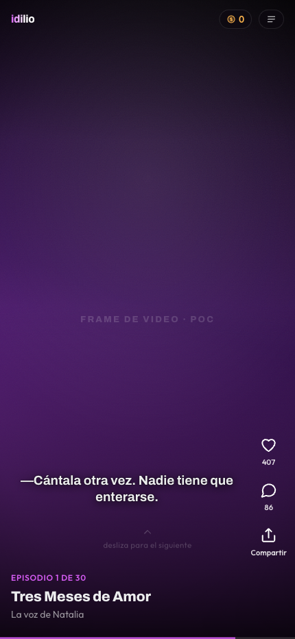 | **Reproductor · episodio libre** | eps 1–10, sin racha |
| 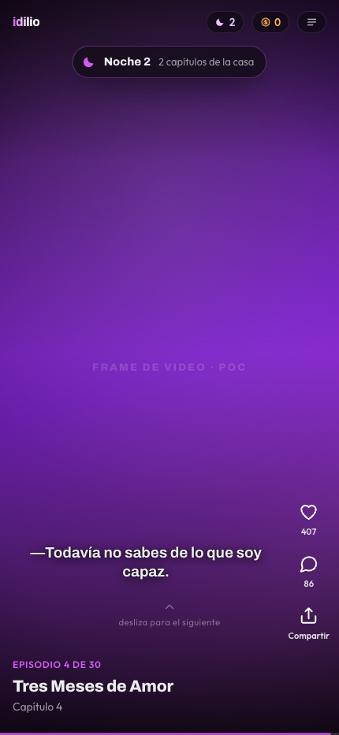 | **Confirmación de racha** | Estado I · noche 2 acreditada |

> **Decisión.** La migaja de economía en el HUD tiene techo estricto: 2 chips, sin fondo sólido,
> nunca sobre la cara. El reproductor es la superficie sagrada y cualquier píxel añadido compite
> con el video. La confirmación es un **toast, no un modal**: interrumpir el video para anunciar
> un premio le cobra al usuario el premio que le acabamos de dar.

### ② Muro de desbloqueo — la intervención
| | Pantalla | Estado |
|---|---|---|
| 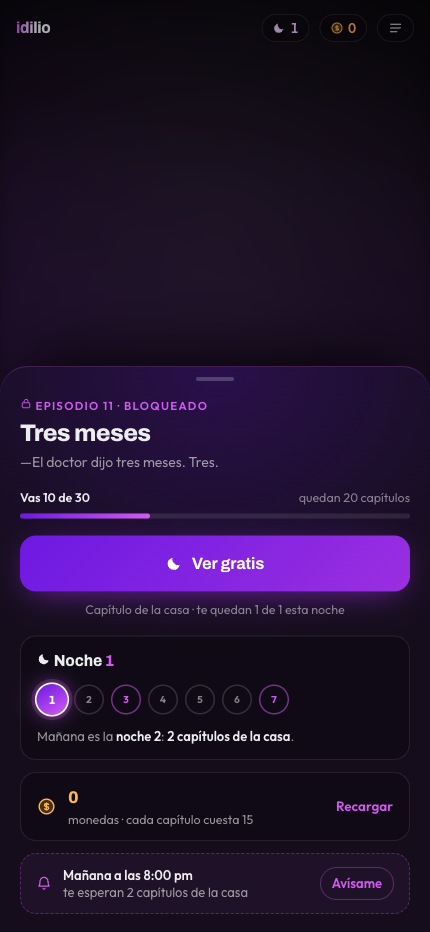 | **A · Noche 1, invitado, sin monedas** | 1 pase · 0 monedas |
| 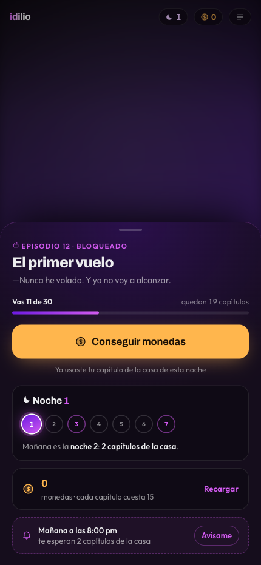 | **B · Pase gastado, sin monedas** | 0 pases · 0 monedas |
| 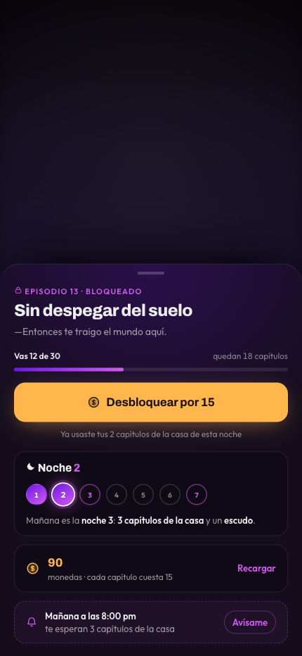 | **C · Pase gastado, con saldo** | 0 pases · 90 monedas |
| 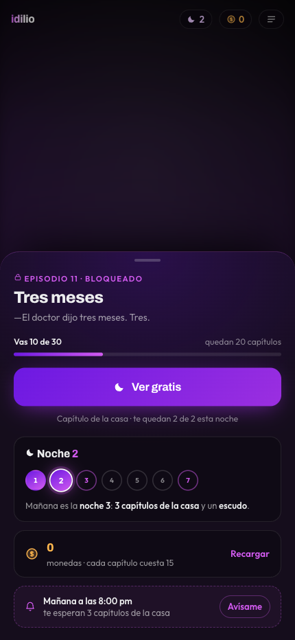 | **D · Noche 2** | 2 pases |
| 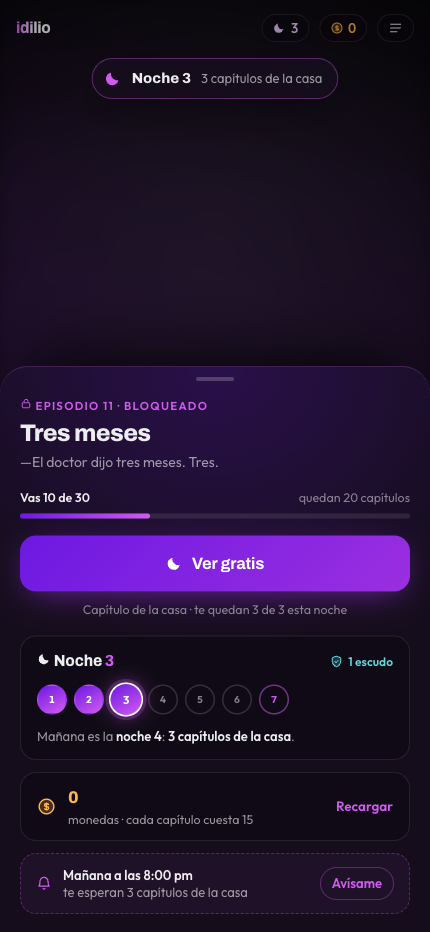 | **E · Noche 3 (hito)** | 3 pases · 1 escudo |
| 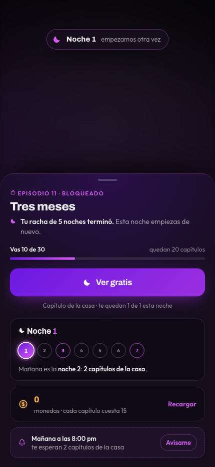 | **F · Racha rota** | venía de 5 noches |
| 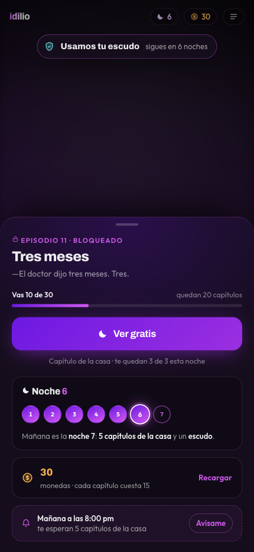 | **G · Escudo consumido** | racha intacta en 6 |
| 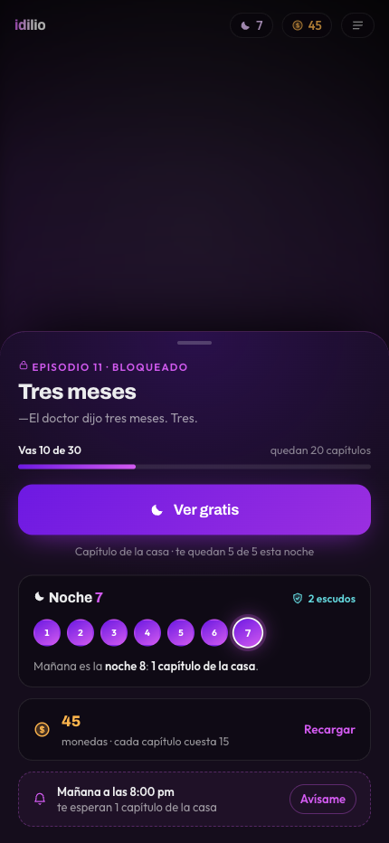 | **H · Noche 7, con cuenta** | 5 pases · 2 escudos |
| 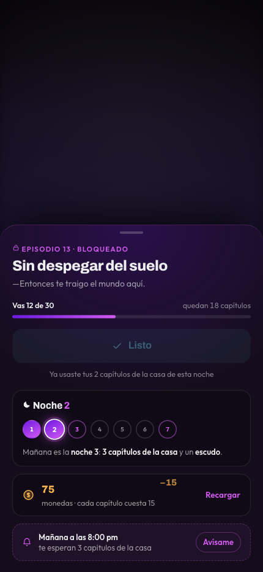 | **El momento del gasto** | 240 ms después del toque |

> **Sobre las animaciones.** Ninguna es decorativa. Si el saldo simplemente cambia de número,
> el usuario no percibe que pagó — y **percibir el gasto es la mitad de entender la economía**.
> Por eso: el saldo se interpola, sale un recibo `−15`, el CTA se confirma en el sitio durante
> 880 ms antes de cerrar, la barra de posición avanza un capítulo, y la luna de la noche nueva
> entra con un halo que se expande una sola vez. Todas respetan `prefers-reduced-motion`.
>
> **Decisión central.** El orden vertical **es** el argumento:
> `deseo → posición → acción gratuita → promesa de regreso → precio → cita`.
> El precio va **después** de que el usuario ya sabe que hay una vía sin pagar. Quien compra
> ahí compra por impaciencia, no por bloqueo.
>
> **Verificado en el POC:** los seis bloques caben **sin scroll** en 430×932. La economía
> completa —dos fuentes, el sumidero, el saldo y la posición— entra en una sola pantalla.

### ③ Cuenta como seguro de la racha
| | Pantalla | Estado |
|---|---|---|
| 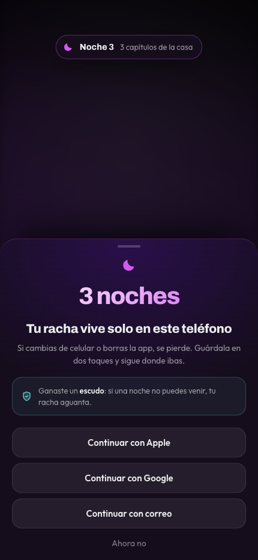 | **Guarda tu racha** | noche 3 · invitado |

> **Decisión.** No dice «crea tu cuenta para desbloquear beneficios». Dice **qué se pierde**.
> Y llega la única noche en que por primera vez hay algo real que perder.
> *Guardarraíl:* si tras el prompt caen los episodios por sesión, el momento estaba mal
> elegido y se retrasa a la noche 5. La conversión a cuenta no puede comprarse con consumo.

### ④ Fuente comprada
| | Pantalla | Estado |
|---|---|---|
| 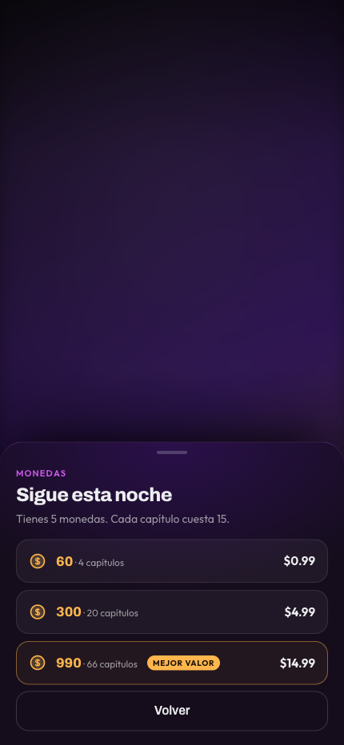 | **Tienda de monedas** | 3 paquetes |

> **Decisión.** Cada paquete se rotula en **capítulos**, no en monedas (`300 · 20 capítulos`).
> Nadie sabe cuánto vale una moneda; todo el mundo sabe cuánto vale un capítulo.

---

## Librería de patrones

| Patrón | Qué resuelve |
|---|---|
| `bottom-sheet-paywall` | Muro como hoja sobre el frame difuminado, nunca pantalla nueva. Mantiene el deseo visible mientras se lee el precio. |
| `earned-currency-cta` | El CTA primario es la moneda **ganada** cuando existe; la comprada baja a secundaria. Se invierte solo cuando la ganada se agotó. |
| `streak-tracker` | Siete lunas numeradas. Los hitos (3 y 7) se preanuncian con borde magenta antes de alcanzarlos. |
| `return-appointment` | Cita explícita con hora + recordatorio opcional. Sin esto, el regreso depende de la memoria del usuario. |
| `non-blocking-toast` | Confirmación de progreso que no detiene el video. |
| `loss-framed-signup` | Registro como seguro sobre algo ya ganado, no como peaje de entrada. |
| `value-in-outcome-units` | Precios en la unidad que el usuario entiende (capítulos), no en la interna (monedas). |
| `no-blame-copy` | Al romperse una mecánica de constancia, informar y reabrir; nunca culpar. |
| `spend-receipt` | Un «−15» que sube y se desvanece sobre el saldo. Hace visible el gasto que el contador por sí solo esconde. |
| `optimistic-counter` | El saldo se interpola hacia el valor nuevo (~620 ms) en vez de saltar. El usuario ve bajar su dinero. |
| `confirm-in-place` | El CTA se convierte en confirmación (✓) antes de cerrar, en vez de desaparecer al instante. |
| `hud-mute-on-sheet` | Con el sheet abierto, los chips del HUD se apagan: la economía ya está completa abajo. |

---

## Sistema visual (tokens reales del producto)

Extraídos de `www.idilio.tv` en producción, no inventados.

| Token | Valor | Uso |
|---|---|---|
| `--home-black` | `#000000` | fondo base |
| `--home-surface-1/2/3` | `#0b070f` · `#150d1c` · `#1e1426` | superficies |
| `--home-magenta` | `#d25af0` | acento de marca |
| `--home-violet` | `#6d19e2` | acento secundario, gradientes |
| `--home-cyan` | `#63d6dc` | escudo / informativo |
| `--home-amber` | `#ffb64d` | **moneda comprada** |
| texto base | `#ecedee` | |

**Regla semántica que hace legible la doble moneda:**
la moneda **ganada** y la racha visten violeta→magenta (los colores de la marca: el capítulo
es *de la casa*); la moneda **comprada** viste ámbar. Las dos monedas **nunca** comparten
familia cromática. Eso comunica el principio de doble moneda sin una sola línea de copy.

**Tipografía.** El producto usa `sofiaPro` (UI) y `newHero` (display), ambas de licencia
comercial. El POC sustituye por **Outfit** y **Archivo**, los equivalentes libres más
cercanos en eje geométrico y aperturas. La sustitución se declara; no se disimula.

---

## Accesibilidad — verificado, no afirmado

Auditoría con **axe-core** (`a11y-mcp`) sobre `wcag2a`, `wcag2aa`, `wcag21a`, `wcag21aa` y `best-practice`:

```
violaciones: 0   ·   reglas aprobadas: 23
```

Tres correcciones que salieron de la auditoría y del cálculo de contraste, no de la intuición:

1. **El gradiente del CTA se corta en `#9b2fe0` y no llega al magenta de marca.** Blanco sobre
   `#d25af0` da **3,25:1** y no pasa AA para texto normal; sobre `#9b2fe0` da **5,42:1**.
   *La marca cede ante la legibilidad.*
2. **El token de texto tenue subió de `0.38` a `0.52` de alfa.** A `0.38` daba **3,3:1** sobre
   `--home-surface-2`; a `0.52` da **4,8:1**.
3. **Se quitó `maximum-scale=1`** del viewport, que bloqueaba el zoom en móvil.
